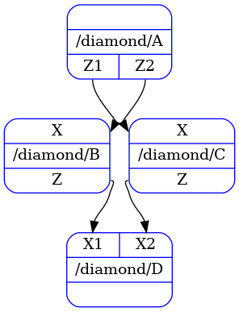

 # Beginners Tutorial

## "Hello World" Example

Let's start writing the most simple pipeline that takes no inputs or outputs and prints
`"Hello World"` on screen.

The first step is to write a *processor* with the printing functionality.
We need to define a `process` method with no input and no output.


```python
class HelloWorld:
    def process(self) -> None:
        print("Hello World")
```

To create a pipeline and run it, we can use the following lines:


```python
from oneml.processors import PipelineBuilder, PipelineRunner

hello_world = PipelineBuilder.task(HelloWorld, "hello_world")  # creates a pipeline of single node
runner = PipelineRunner(hello_world)  # creates a runner for the given pipeline
runner()  # runs the pipeline
```

## "Diamond" Pipeline Example

Consider now we have four classes, i.e., `A`, `B`, `C` and `D` with some inputs and outputs and we
want to connect them following a diamond-based shape:

```
  A           B <- A
 / \          C <- A
B   C         D <- B
 \ /          D <- C
  D
```

We have the following classes and declared outputs:


```python
from typing import Any, TypedDict

AOutput = TypedDict("AOutput", {"Z1": float, "Z2": float})
BOutput = TypedDict("BOutput", {"Z": float})
COutput = TypedDict("COutput", {"Z": float})


class A:
    def process(self) -> AOutput:
        ...


class B:
    def process(self, X: Any) -> BOutput:
        ...


class C:
    def process(self, X: Any) -> COutput:
        ...


class D:
    def process(self, X1: Any, X2: Any) -> None:
        ...


```

*Processors* can have arbitrary inputs, in this case we have processors with empty, single, single
and two inputs, respectively.

*Processors* declare their outputs too.
To declare outputs, the `process` method needs to return a mapping with variable names and values,
i.e., `Mapping[str, Any]`, or `None`.
`TypedDict` is a useful built-in type to declare the variable names and types, which we used to
specify that *processor* `A` returns two outputs, `B` and `C` return a single output, and `D`
returns nothing.

Once we have written our *processor* classes, we need to create a pipeline and run it.
We start by creating a single node pipeline per *processor*, which we refer as a *task*.
Then we combine all 4 *tasks* into a single pipeline by declaring the input/output *dependencies*
that exist between *tasks*:


```python
from oneml.processors import PipelineBuilder, PipelineRunner, display_dag

a = PipelineBuilder.task(A, "A")
b = PipelineBuilder.task(B, "B")
c = PipelineBuilder.task(C, "C")
d = PipelineBuilder.task(D, "D")

diamond = PipelineBuilder.combine(
    a,
    b,
    c,
    d,
    dependencies=(
        b.inputs.X << a.outputs.Z1,
        c.inputs.X << a.outputs.Z2,
        d.inputs.X1 << b.outputs.Z,
        d.inputs.X2 << c.outputs.Z,
    ),
    name="diamond",
)

display_dag(diamond)  # displays the pipeline

```



We have seen in these examplea that pipelines, whether made from a single node or multiple, expose
*inputs* and *outputs*, and we can access them directly to create dependencies between different
pipelines.
The *left-shift* and *right-shift* notation, i.e., `<<`, `>>`, respectively, are the operators that
to create such *dependencies*, which will return a tuple holding the *dependency* information.

If the user accesses an input or output that do not exist, or confuses the direction of the
dependency, a run-time error will be raised.
This is why we have to declare the inputs and outputs of *processors*.


## Standardized Logistic Regression Example

We are now going to build a standardized logistic example where we have two sources for input,
i.e., *train* and *eval*.
We will also show how to build pipelines of more than a single node, and how to connect these into
larger pipelines.

This is the resulting pipeline we want to build:


We start by writing the necessary *processors*, which declare inputs and outputs.
Note that *processors* can depend on parameters both on the `__init__` and `process` methods, as
shown below.


```python
from typing import TypedDict

StandardizeTrainOut = TypedDict(
    "StandardizeTrainOut", {"mean": float, "scale": float, "Z_train": float}
)
StandardizeEvalOut = TypedDict("StandardizeEvalOut", {"Z_eval": float})
LogisticRegressionTrainOut = TypedDict(
    "LogisticRegressionTrainOut", {"model": tuple[float], "Z_train": float}
)
LogisticRegressionEvalOut = TypedDict("LogisticRegressionEvalOut", {"Z_eval": float})


class StandardizeTrain:
    def process(self, X_train: float) -> StandardizeTrainOut:
        ...


class StandardizeEval:
    def __init__(self, mean: float, scale: float) -> None:
        ...

    def process(self, X_eval: float) -> StandardizeEvalOut:
        ...


class LogisticRegressionTrain:
    def process(self, X_train: float, Y_train: float) -> LogisticRegressionTrainOut:
        ...


class LogisticRegressionEval:
    def __init__(self, model: tuple[float, ...]) -> None:
        ...

    def process(self, X_eval: float, Y_eval: float) -> LogisticRegressionEvalOut:
        ...


```

We create single node pipelines, aka. *tasks*, and combine them, similar to how we did with in the
diamond pipeline example, to create `standardization` and `logistic_regression`.


```python
from oneml.processors import PipelineBuilder, PipelineRunner

stz_train = PipelineBuilder.task(StandardizeTrain, "stz_train")
stz_eval = PipelineBuilder.task(StandardizeEval, "stz_eval")
lr_train = PipelineBuilder.task(LogisticRegressionTrain, "lr_train")
lr_eval = PipelineBuilder.task(LogisticRegressionEval, "lr_eval")

standardization = PipelineBuilder.combine(
    stz_train,
    stz_eval,
    dependencies=(
        stz_eval.inputs.mean << stz_train.outputs.mean,
        stz_eval.inputs.scale << stz_train.outputs.scale,
    ),
    name="standardization",
)

logistic_regression = PipelineBuilder.combine(
    lr_train,
    lr_eval,
    dependencies=(lr_eval.inputs.model << lr_train.outputs.model,),
    name="logistic_regression",
)

```

The next step is to combine both pipelines into a single one and connect all dependencies
between them.


```python
from oneml.processors import display_dag

standardized_lr = PipelineBuilder.combine(
    standardization,
    logistic_regression,
    name="standardized_lr",
    dependencies=(
        logistic_regression.inputs.X_train << standardization.outputs.Z_train,
        logistic_regression.inputs.X_eval << standardization.outputs.Z_eval,
    ),
)

display_dag(standardized_lr)  # displays the pipeline

```


There are a few points to clarify here.
First, combining pipelines of a single node, two nodes or more, are synthactically the same.
It does not matter how many nodes a pipeline has, as long as inputs and outputs and dependencies
are correctly specified when combining.

Second, pipelines can be combined in different order and the resulting pipeline can be the same.
In this example, we first built the standardization and logistic_regression pipelines, and then
compose these together.
It needn't have been so and we show below two alternatives that yield the same result.

Third, the *processors* that we defined above do not have conflicting output names, i.e., all
output variable names are different.
This simplifies the exposition of the example, but in the [intermediate tutorial](intermediate.md)
we explain what happens when we combine pipelines that expose the same output variable names.

### A Second Alternative to Standardized Logistic Regression Example

As explained before, we built `standardized_lr` by first building `standardization` and
`logistic_regression` and then combining them.
An alternative is to first build the `train` and `eval` pipelines separately, and then combine.
The following code yields the same result as before:


```python
train_pipeline = PipelineBuilder.combine(
    stz_train,
    lr_train,
    name="train_pipeline",
    dependencies=(lr_train.inputs.X_train << stz_train.outputs.Z_train,),
)

eval_pipeline = PipelineBuilder.combine(
    stz_eval,
    lr_eval,
    name="eval_pipeline",
    dependencies=(lr_eval.inputs.X_eval << stz_eval.outputs.Z_eval,),
)

standardized_lr = PipelineBuilder.combine(
    train_pipeline,
    eval_pipeline,
    name="standardized_lr",
    dependencies=(
        eval_pipeline.inputs.mean << train_pipeline.outputs.mean,
        eval_pipeline.inputs.scale << train_pipeline.outputs.scale,
        eval_pipeline.inputs.model << train_pipeline.outputs.model,
    ),
)

```

There is no difference between `standardize_lr` pipelines obtained from these two procedures, the
resulting pipelines are exactly the same.

### A Third Alternative to Standardized Logistic Regression Example

A third alternative is to build the whole pipeline in a single combine operation.
The only drawback to doing it this way is that pipelines are less modular, in a conceptual sense,
to share between users, whereas the first and second approach encapsulate the concepts and make
those explicit to share, via standardization / logistic_regression, or via train / eval pipelines,
respectively.


```python
standardized_lr = PipelineBuilder.combine(
    stz_train,
    lr_train,
    stz_eval,
    lr_eval,
    name="standardized_lr",
    dependencies=(
        stz_eval.inputs.mean << stz_train.outputs.mean,
        stz_eval.inputs.scale << stz_train.outputs.scale,
        lr_eval.inputs.model << lr_train.outputs.model,
        lr_train.inputs.X_train << stz_train.outputs.Z_train,
        lr_eval.inputs.X_eval << stz_eval.outputs.Z_eval,
    ),
)
```

## Standardized LR with Data

The previous `standardized_lr` had unspecified inputs, in particular, `X` and `Y` have been left
unspecified.
This means that the pipeline is not runnable yet, but if we connect the missing dependencies, the
resulting pipeline will be runnable.

In terms of results it does not matter the order in which build the pipelines, but encapsulating
them as intermediate formulations makes it easier to reuse them.
That's why we separated connecting `standardized_lr` to any data.


```python
LoadDataOut = TypedDict(
    "LoadDataOut", {"X_train": float, "X_eval": float, "Y_train": float, "Y_eval": float}
)


class LoadData:
    def process(self) -> LoadDataOut:
        ...


load_data = PipelineBuilder.task(LoadData, "load_data")

final_pipeline = PipelineBuilder.combine(
    load_data,
    standardized_lr,
    name="final_pipeline",
    dependencies=(
        standardized_lr.inputs.X_train << load_data.outputs.X_train,
        standardized_lr.inputs.X_eval << load_data.outputs.X_eval,
        standardized_lr.inputs.Y_train << load_data.outputs.Y_train,
        standardized_lr.inputs.Y_eval << load_data.outputs.Y_eval,
    ),
)

display_dag(final_pipeline)  # displays the pipeline

```


