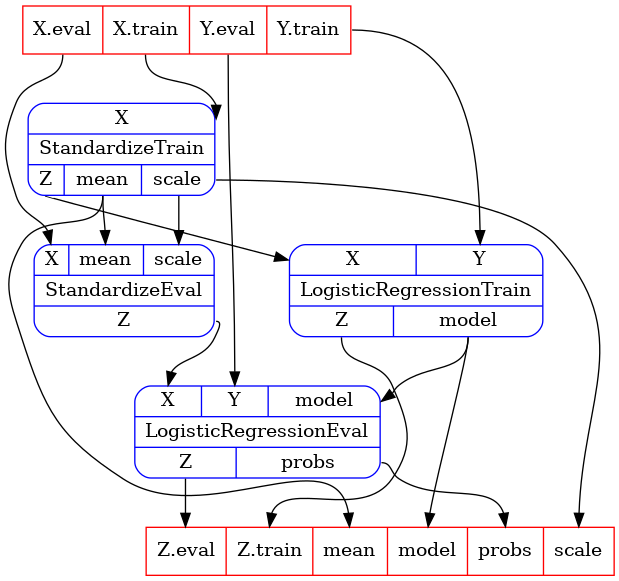
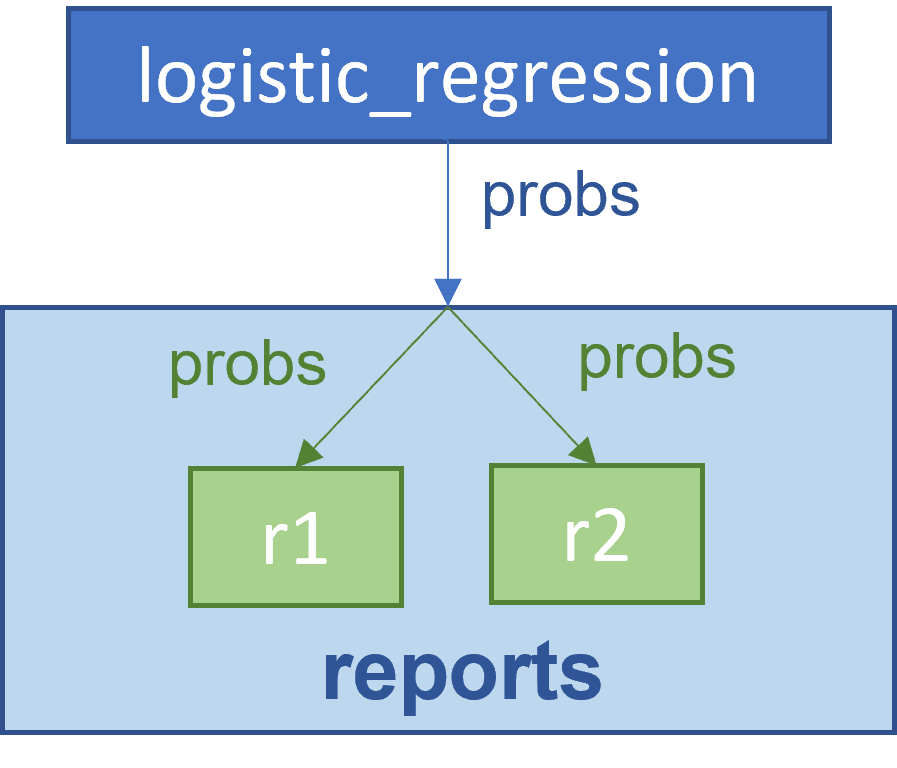
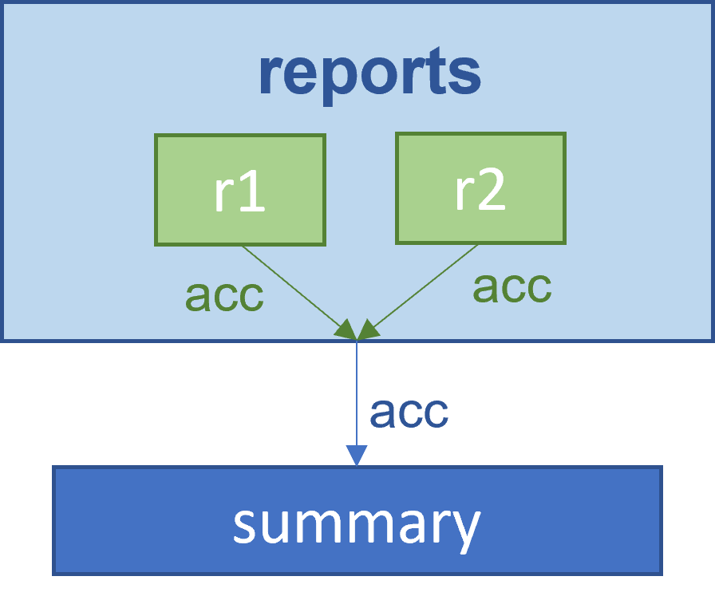

# Advanced Tutorial

In this tutorial we will dive deeper into concepts, and will allow you to reconfigure pipelines
and build your own meta-pipelines.

#### Table of Contents

- [Operations with Parameter Entries and Collections](#operations-with-parameter-entries-and-collections)
  - [`InEntry` & `OutEntry`](#inentry--outentry)
    - [Left and right shift operations](#left-and-right-shift-operations)
    - [Merge `InEntry`](#merge-inentry)
    - [Merge `OutEntry`](#merge-outentry)
  - [`Inputs` & `Outputs`](#inputs--outputs)
    - [Left and right shift operations](#left-and-right-shift-operations-1)
    - [Merge operations](#merge-operations)
    - [Subtract operations](#subtract-operations)
  - [`InCollections` & `OutCollections`](#incollections--outcollections)
    - [Left and right shift operations](#left-and-right-shift-operations-2)
    - [Merge operations](#merge-operations-1)
    - [Subtract operations](#subtract-operations-1)
  - [`Pipeline`](#pipeline)
    - [Left and right shift operations](#left-and-right-shift-operations-3)
    - [Rename inputs and outputs](#rename-inputs-and-outputs)
    - [Decorate pipelines](#decorate-pipelines)
- [Pipelines Definition](#pipelines-definition)
- [Meta-Pipelines](#meta-pipelines)
  - [`Estimator` Example](#estimator-example)
- [Services](#services)

## Operations with Parameter Entries and Collections

Consider the `standardization`, `logistic_regression` and `stz_lr` examples from the
[intermediate tutorial](tutorial_intermediate.md).

{ width="300" }

### `InEntry` & `OutEntry`

#### Left and right shift operations

You can create dependencies using left and right shift operators:

```python
stz_train.outputs.mean >> lr_eval.inputs.mean
lr_eval.inputs.scale << stz_train.outputs.scale
```

or

```python
standardization.out_collections.Z.train >> logistic_regression.in_collections.X.train
logistic_regression.in_collections.X.eval << standardization.out_collections.Z.eval
```

These operators return a dependency wrapped in a tuple (for compatibility with collections).
They can be passed as part of dependencies for combining pipelines.

#### Merge `InEntry`

You can merge two `InEntry` into a single one using `|` between entries, which will bind the inputs
together, exposing a single entry.
For example,

```python
from typing import NamedTuple
from oneml.processors import PipelineBuilder

class ReportOut(NamedTuple):
    acc: float

class Report:
    def process(probs: float) -> ReportOut:
        ...

r1 = PipelineBuilder.task(Report, name="r1")
r2 = PipelineBuilder.task(Report, name="r2")
reports = PipelineBuilder.combine(
    pipelines=[r1, r2],
    name="reports",
    inputs={"probs": r1.inputs.probs | r2.inputs.probs},  # merge operation
)
reports.inputs.probs << logistic_regression.outputs.probs  # will return two dependencies
```

We combine `r1` and `r2` into a single pipeline and we expose `probs` as single input, which is the
merge of `probs` from `r1` and `r2`.
Therefore, when used in as a dependency assignment, a broadcast operation will be performed
mapping the `probs` from `logistic_regression` to both `r1` and `r2`.

{ width="300" }

#### Merge `OutEntry`

If you merge `OutEntry`s with `|` operator you will indicate that the outputs are to be
concatenated.
For example,

```python
from typing import NamedTuple, Sequence
from oneml.processors import PipelineBuilder

class ReportOut(NamedTuple):
    acc: float

class Report:
    def process(probs: float) -> ReportOut:
        ...

class Summary:
    def process(accuracies: Sequence[float]) -> None:
        ...

r1 = PipelineBuilder.task(Report, name="r1")
r1 = PipelineBuilder.task(Report, name="r2")
summary = PipelineBuilder.task(Summary, name="summary")
reports = PipelineBuilder.combine(
    pipelines=[r1, r2],
    name="reports",
    outputs={"acc": r1.outputs.acc | r2.outputs.acc},  # merge operation
)
# will return single dependency that is the concatenatation of r1.outputs.acc and r2.outputs.acc:
summary.inputs.accuracies << reports.outputs.acc
```

We combine `r1` and `r2` into a single pipeline and we expose `acc` as single output, which is the
concatenation of `acc` from `r1` and `r2`.
Therefore, when used in as a dependency assignment, a concatenation operation will be performed
gathering the `acc` from `r1` and `r2` into a single `acc` before passing it to `summary`.

Order is preserved in all merge operations.

{ width="300" }

### `Inputs` & `Outputs` and `InCollection` & `OutCollection`

`InCollection` and `OutCollection` are aliases of `Inputs` and `Outputs`, respectively, and
operations between them are identical.

#### Left and right shift operations

Similar to entry assignments, you can create dependencies using the left and right shift operators.

```python
stz_eval.inputs << stz_train.outputs  
```

which is equivalent to:

```python
stz_eval.inputs.mean << stz_train.outputs.mean
stz_eval.inputs.scale << stz_train.outputs.scale
```

or alternatively, operating with collections:

```python
logistic_regression.in_collections.X << standardization.out_collections.Z
```

which is equivalent to:

```python
logistic_regression.in_collections.X.train << standardization.out_collections.Z.train
logistic_regression.in_collections.X.eval << standardization.out_collections.Z.eval
```

> :bulb: **Info:**
The set of names of the two collections need to be identical.
Entries will be matched by name to create depedencies, e.g.,
`Z.train` with `X.train` and `Z.eval` with `X.eval`, respectively, in the above example.

The operation returns a tuple of dependencies created.

#### Merge operations

You can merge two collections into a single one using `|` between collections.
For example,

```python
stz_train = stz_train.rename_inputs({"X": "X.train"})
stz_eval = stz_eval.rename_inputs({"X": "X.eval"})
X_collection = stz_train.in_collections.X | stz_eval.in_collections.X
X_collection.train  # OutEntry objects
X_collection.eval
```

The above example will create a single collection with two entries, `X.train` and `X.eval`.
The entries come from the merge of `X` from `stz_train` and `stz_eval`, respectively.
If the collections share the same entry names, entries will be merged together as well.

This behavior is the same for `Outputs` objects.

The behavior for creating collections via `rename_inputs` or `rename_outputs` is explained in this
[section](##rename-inputs-and-outputs) below.

#### Subtract operations

You can subtract variable names or entry parameters:

```python
new_inputs = standardization.in_collections - ("X",)
new_inputs = standardization.in_collections - (standardization.in_collections.X.train,)
```

The syntax requires subtracting an `Iterable` (like `tuple`, `list`, `set`, etc.).
If what you are trying to subtract does not exist, no error will be issued.

### `InCollections` & `OutCollections`

#### Left and right shift operations

In the same spirit as with other types, one can do left and right shift operations on
`InCollections` and `OutCollections` types.

Shared variables between pipelines will be associated together:

```python
logistic_regression.out_collections >> logistic_regression.in_collections
```

which is equivalent to

```pythyon
logistic_regression.out_collections.X >> logistic_regression.in_collections.X
logistic_regression.out_collections.Y >> logistic_regression.in_collections.Y
```

Using the left / right operator in the wrong direction will raise an error.

#### Merge operations

Similar to `Inputs` and `Outputs`, one can merge `InCollections` and `OutCollections`.
Collections and entries will be merged together.

#### Subtract operations

You can subtract variables, single parameters, or collection of parameters:

```python
new_inputs = standardization.in_collections - ("X",)
new_inputs = standardization.in_collections - (standardization.in_collections.X,)
new_inputs = standardization.in_collections - (standardization.in_collections.X.train,)
```

All of the above are equivalent for `X` a collection of length one.
Otherwise, the whole collection will be subtracted if you pass `X` or
`standardization.in_collections.X`.

Note that the syntax requires subtracting an `Iterable` (like `tuple`, `list`, `set`, etc.).
If what you are trying to subtract does not exist, no error will be issued.

### `Pipeline`

#### Left and right shift operations

The IO attributes above are slightly redundant in the above example, so one can simplify
directly operating with pipelines.

Left / right shifting with pipeline objects will create the dependencies between the `inputs` and
`outputs`, `in_collections` and `out_collections`, of the pipelines in the direction of the shift,
for equally named collections.

Here is an example:

```python
stz_train >> stz_eval
```

which would be equivalent to

```python
stz_train.outputs.mean >> stz_eval.inputs.mean
stz_train.outputs.scale >> stz_eval.inputs.scale
```

Beware that the following would produce no dependencies, because there are no shared variable names

```python
dependencies = stz_train << stz_eval
assert len(dependencies) == 0
```

#### Rename inputs and outputs

You can rename inputs and outputs of a pipeline with `rename_inputs` and `rename_outputs`.

The syntax is {"<old_name>": "<new_name>"} as single method's argument.
The methods will return a new pipeline with same structure, and renamed inputs / outputs,
according to the given mapping.

For example, if we want to rename the `X` input of `stz_train` to `features`:

```python
stz_train = stz_train.rename_inputs({"X": "features"})
stz_train.inputs.features  # InEntry object
```

You can transform single entries into collections, or entries from collections into entries via dot
notation:

```python
standardization = standardization.rename_inputs({"X.train": "X_train", "X.eval": "X_eval"})
standardization.inputs.X_train  # InEntry objects
standardization.inputs.X_eval
# standardization.in_collections.X.train  # raises error
```

If the new name of an entry already exists, or repeats, a merge operation will be performed.

```python
r1 = PipelineBuilder.task(Report, name="r1")
r2 = PipelineBuilder.task(Report, name="r2")
reports = PipelineBuilder.combine(
    r1, r2,
    name="reports",
    inputs={"acc.r1": r1.outputs.acc, "acc.r2": r2.outputs.acc}
)
reports.in_collection.acc  # Inputs collection with two entries
reports.rename_inputs({"acc.r1": "acc", "acc.r2": "acc"})  # rename / merge operation
reports.inputs.acc # InEntry object with two entries merged together
```

#### Decorate pipelines

You can `decorate` a pipeline, i.e., wrap a pipeline under another name:

```python
new_pipeline = my_pipeline.decorate("p")
```

This is useful when combining pipelines of the same type that need to be unique.
Consider the following example:

```python
class Report:
    def process(probs: float) -> None:
        ...

report = PipelineBuilder.task(Report)
r1 = report.decorate("r1")
r2 = report.decorate("r2")
reports = PipelineBuilder.combine(
    pipelines=[r1, r2],
    name="reports",
    dependencies=(
        one_pipeline.outputs.probs >> r1.inputs.probs,
        two_pipeline.outputs.probs >> r2.inputs.probs, 
    )
)
```

To combine pipelines with the same name, you can decorate them first and then combine.

## Pipelines Definition

A `Pipeline` is a (frozen) dataclass with the following attributes:

- `name` (`str`): of the pipeline; used as the default value for collection entries; useful to
    distinguiss pipelines when combining.
- `inputs` (`oneml.processors.Inputs`): exposure of `Inputs` of a pipeline.
- `outputs` (`oneml.processors.Outputs`): exposure of `Outputs` of a pipeline.
- `in_collections` (`oneml.processors.InCollections`): exposure of `InCollections` of a pipeline.
- `out_collections` (`oneml.processors.OutCollections`): exposure of `OutCollections` of a
    pipeline.

`Pipeline`s should not be instantiated directly.
Instead, `Pipeline`s should be created via `Task`s, combining other `Pipeline`s, or other
constructors, e.g., `Estimator`.

## Meta-Pipelines

We will see a few examples on how to use operations to create and compose pipelines.

### `Estimator` Example

```python
@dataclass(frozen=True, init=False)
class Estimator(Pipeline):
    def __init__(
        self,
        name: str,
        train_pl: Pipeline,
        eval_pl: Pipeline,
        dependencies: Iterable[Sequence[Dependency]] = ((),),
    ) -> None:
        # find shared parameters between train and eval
        in_common = set(train_pl.inputs) & set(eval_pl.inputs)
        out_common = set(train_pl.outputs) & set(eval_pl.outputs)

        # rename shared parameters into train & eval entries of collections
        train_pl = train_pl.rename_inputs({v: v + ".train" for v in in_common})
        train_pl = train_pl.rename_outputs({v: v + ".train" for v in out_common})
        eval_pl = eval_pl.rename_inputs({v: v + ".eval" for v in in_common})
        eval_pl = eval_pl.rename_outputs({v: v + ".eval" for v in out_common})

        # decorate train and eval pipelines for tracking purposes
        train_pl = train_pl.decorate("train")
        eval_pl = eval_pl.decorate("eval")

        # decorate shared dependencies to match newly decorated train and eval pipelines
        dependencies = (dp.decorate("eval", "train") for dp in chain.from_iterable(dependencies))

        # merge the `outputs` and `out_collections` of train and eval pipelines
        outputs: UserOutput = dict(train_pl.outputs | eval_pl.outputs)
        outputs |= dict(train_pl.out_collections | eval_pl.out_collections)

        # combine all ingredients into a new pipeline
        p = PipelineBuilder.combine(
            train_pl,
            eval_pl,
            name=name,
            outputs=outputs,
            dependencies=(tuple(dependencies),),
        )
        super().__init__(name, p._dag, p.inputs, p.outputs, p.in_collections, p.out_collections)
```

A few clarifications:

1. We made `Estimator` a (frozen) dataclass extending `Pipeline`. This is because we consider
`Estimator` a concept and wanted to give it an entity, but this does not need to be so.

2. Arguments include a `train` and `eval` pipelines, estimator's name, and dependencies.

3. The first step is to find the common inputs/outputs between the `train` and `eval` pipelines.
Then, rename inputs/outputs into collection entries: any entry with the pipeline's name is renamed
into `train` and `eval`, respectively.

4. We decorate the `train` and `eval` pipelines before merging. This will ensure the combination
is valid.

5. Outputs are specified by merging the outputs of the `train` and `eval` pipelines, before
subtracting specified dependencies.

6. Inputs are merged by subtracting the specified dependencies, default behavior.

7. Pipelines are combined, and a new `Pipeline` returned.

## Services

TBD
