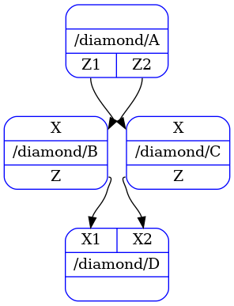
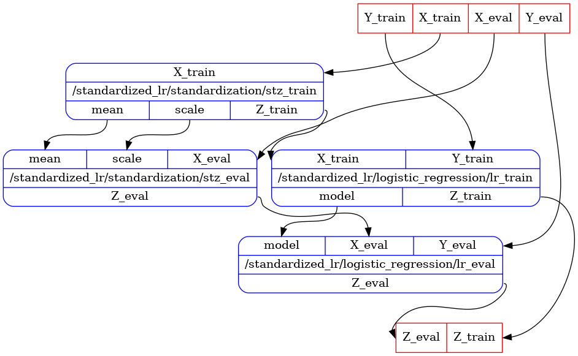

# Beginners Tutorial

This tutorial is also available in notebook form. See [Tutorial Notebooks](notebooks.md).

## "Hello World" Example

Let's start writing the most simple pipeline that takes no inputs or outputs and prints
`"Hello World"` on screen.

The first step is to write a *processor's* class with the printing functionality.
We need to define a `process` method with no input and no output.

```python
class HelloWorld:
    def process(self) -> None:
        print("Hello World")
```

To create a pipeline and run it, we can use the following lines:

```python
from oneml.processors import OnemlProcessorsServices
from oneml.processors.ux import PipelineBuilder

hello_world = PipelineBuilder.task(HelloWorld, "hello_world")  # creates a pipeline of single node

runner_factory = oneml_service_provider.get_service(OnemlProcessorsServices.PIPELINE_RUNNER_FACTORY)
runner = runner_factory(hello_world)  # creates a runner for the given pipeline
runner()  # runs the pipeline
```

We will dive into details at the end of [this](#oneml-services) and
[next](tutorial_intermediate.md) tutorials.

## "Diamond" Pipeline Example

Consider now we have four classes, i.e., `A`, `B`, `C` and `D` with some inputs and outputs and we
want to connect them following a diamond-based shape:

```
  A           B <- A
 / \          C <- A
B   C         D <- B
 \ /          D <- C
  D
```

We have the following classes and declared outputs:

```python
from typing import Any, NamedTuple

class AOutput(NamedTuple):
    Z1: Any
    Z2: Any

class A:
    def process(self) -> AOutput:
        ...

class BOutput(NamedTuple):
    Z: Any
    
class B:
    def process(self, X: Any) -> BOutput:
        ...

class COutput(NamedTuple):
    Z: Any

class C:
    def process(self, X: Any) -> COutput:
        ...

class D:
    def process(self, X1: Any, X2: Any) -> None:
        ...
```

*Processors* can have arbitrary inputs, in this case we have processors with empty, single, single
and two inputs, respectively.

*Processors* declare their outputs too.
To declare outputs, the `process` method needs to return a mapping with variable names and values,
i.e., [`NamedTuple`](https://docs.python.org/3/library/collections.html#collections.namedtuple), 
[`TypedDict`](https://docs.python.org/3/library/typing.html#typing.TypedDict) or `None`.
[`NamedTuple`](https://docs.python.org/3/library/collections.html#collections.namedtuple) is a
python built-in type to declare variable names and types, which we can use to
specify that *processor* `A` returns two outputs, `B` and `C` return a single output, and `D`
returns nothing. Similar declaration can be achieved with
[`TypedDict`](https://docs.python.org/3/library/typing.html#typing.TypedDict) python's built-in.

Once we have written our *processor* classes, we need to create a pipeline and run it.
We start by creating a single node pipeline per *processor*, which we refer as a *task*.
Then we combine all 4 *tasks* into a single pipeline by declaring the input/output *dependencies*
that exist between *tasks*:

```python
from oneml.processors.ux import PipelineBuilder
from oneml.processors.dag import display_dag

a = PipelineBuilder.task(A, "A")
b = PipelineBuilder.task(B, "B")
c = PipelineBuilder.task(C, "C")
d = PipelineBuilder.task(D, "D")

diamond = PipelineBuilder.combine(
    name="diamond",
    pipelines = [a, b, c, d],
    dependencies=(
        b.inputs.X << a.outputs.Z1,
        c.inputs.X << a.outputs.Z2,
        d.inputs.X1 << b.outputs.Z,
        d.inputs.X2 << c.outputs.Z,
    ),
)

display_dag(diamond) # displays the pipeline
```



We have seen in these examplea that pipelines, whether made from a single node or multiple, expose
*inputs* and *outputs*, and we can access them directly to create dependencies between different
pipelines.
The *left-shift* and *right-shift* notation, i.e., `<<`, `>>`, respectively, are the operators that
create [*dependencies*](index.md), which will return a tuple holding the *edge* information.

If the user accesses an input or output that does not exist, or confuses the direction of the
dependency, a run-time error will be raised.
This is why we need to declare the inputs and outputs of a *processor's* class.

## Standardized Logistic Regression Example

We are now going to build a standardized logistic example where we have two sources for input,
i.e., *train* and *eval*.
We will also show how to build pipelines of more than a single node, and how to connect these into
larger pipelines.

This is the resulting pipeline we want to build:


We start by writing the necessary *processor* classes, which declare inputs and outputs.
Note that *processors* can depend on parameters both on the `__init__` and `process` methods, as
shown below.

```python
from typing import NamedTuple

class StandardizeTrainOut(NamedTuple):
    mean: float
    scale: float
    Z_train: float

class StandardizeTrain:
    def process(self, X_train: float) -> StandardizeTrainOut:
        ...

class StandardizeEvalOut(NamedTuple):
    Z_eval: float

class StandardizeEval:
    def __init__(self, mean: float, scale: float) -> None:
        ...

    def process(self, X_eval: float) -> StandardizeEvalOut:
        ...

class LogisticRegressionTrainOut(NamedTuple):
    model: tuple[float, ...]
    Z_train: float

class LogisticRegressionTrain:
    def process(self, X_train: float, Y_train: float) -> LogisticRegressionTrainOut:
        ...

class LogisticRegressionEvalOut(NamedTuple):
    Z_eval: float

class LogisticRegressionEval:
    def __init__(self, model: tuple[float, ...]) -> None:
        ...

    def process(self, X_eval: float, Y_eval: float) -> LogisticRegressionEvalOut:
        ...
```

We create single node pipelines, aka. *tasks*, and combine them, similar to how we did with in the
diamond pipeline example, to create `standardization` and `logistic_regression`.

```python
from oneml.processors.ux import PipelineBuilder
from oneml.processors.dag import display_dag

stz_train = PipelineBuilder.task(StandardizeTrain, "stz_train")
stz_eval = PipelineBuilder.task(StandardizeEval, "stz_eval")
lr_train = PipelineBuilder.task(LogisticRegressionTrain, "lr_train")
lr_eval = PipelineBuilder.task(LogisticRegressionEval, "lr_eval")

standardization = PipelineBuilder.combine(
    name="standardization",
    pipelines=[stz_train, stz_eval],
    dependencies=(
        stz_eval.inputs.mean << stz_train.outputs.mean,
        stz_eval.inputs.scale << stz_train.outputs.scale,
    ),
)

logistic_regression = PipelineBuilder.combine(
    name="logistic_regression",
    pipelines=[lr_train, lr_eval],
    dependencies=(lr_eval.inputs.model << lr_train.outputs.model,),
)
```

The next step is to combine both pipelines into a single one and connect all dependencies
between them.

```python
standardized_lr = PipelineBuilder.combine(
    name="standardized_lr",
    pipelines=[standardization, logistic_regression],
    dependencies=(
        logistic_regression.inputs.X_train << standardization.outputs.Z_train,
        logistic_regression.inputs.X_eval << standardization.outputs.Z_eval,
    ),
)

display_dag(standardized_lr)  # displays the pipeline
```



There are a few points to clarify here.
First, combining pipelines of a single node, two nodes or more, are synthactically the same.
It does not matter how many nodes a pipeline has, as long as inputs and outputs and dependencies
are correctly specified when combining.

Second, pipelines can be combined in different order and the resulting pipeline can be the same.
In this example, we first built the standardization and logistic_regression pipelines, and then
compose these together.
It needn't have been so and we show below two alternatives that yield the same result.

Third, the *processor* classes that we defined above do not have conflicting output names, i.e.,
all output variable names are different.
This simplifies the exposition of the example, but in the [intermediate tutorial](tutorial_intermediate.md)
we explain what happens when we combine pipelines that expose the same output variable names.

### A Second Alternative to Standardized Logistic Regression Example

As explained before, we built `standardized_lr` by first building `standardization` and
`logistic_regression` and then combining them.
An alternative is to first build the `train` and `eval` pipelines separately, and then combine.
The following code yields the same result as before:

```python
train_pipeline = PipelineBuilder.combine(
    name="train_pipeline",
    pipelines=[stz_train, lr_train],
    dependencies=(lr_train.inputs.X_train << stz_train.outputs.Z_train,),
)

eval_pipeline = PipelineBuilder.combine(
    name="eval_pipeline",
    pipelines=[stz_eval, lr_eval],
    dependencies=(lr_eval.inputs.X_eval << stz_eval.outputs.Z_eval,),
)

standardized_lr = PipelineBuilder.combine(
    name="standardized_lr",
    pipelines=[train_pipeline, eval_pipeline],
    dependencies=(
        eval_pipeline.inputs.mean << train_pipeline.outputs.mean,
        eval_pipeline.inputs.scale << train_pipeline.outputs.scale,
        eval_pipeline.inputs.model << train_pipeline.outputs.model,
    ),
)
```

There is no difference between `standardize_lr` pipelines obtained from these two procedures, the
resulting pipelines are exactly the same.

### A Third Alternative to Standardized Logistic Regression Example

A third alternative is to build the whole pipeline in a single combine operation.
The only drawback to doing it this way is that pipelines are less modular, in a conceptual sense,
to share between users, whereas the first and second approach encapsulate the concepts and make
those explicit to share, via standardization / logistic_regression, or via train / eval pipelines,
respectively.

```python
standardized_lr = PipelineBuilder.combine(
    name="standardized_lr",
    pipelines=[stz_train, lr_train, stz_eval, lr_eval],
    dependencies=(
        stz_eval.inputs.mean << stz_train.outputs.mean,
        stz_eval.inputs.scale << stz_train.outputs.scale,
        lr_eval.inputs.model << lr_train.outputs.model,
        lr_train.inputs.X_train << stz_train.outputs.Z_train,
        lr_eval.inputs.X_eval << stz_eval.outputs.Z_eval,
    ),
)
```

## OneML services

The OneML services framework is a dependency injection plugin system. 
It allows code in different python libraries to expose service interfaces, and to define how
service objects implementing these interfaces are initialized.

For now, it is sufficient to understand that:

1. Different components expose services by providing classes with service ids as class members.
   For example `OnemlProcessorsServices` is exposed by `oneml.processors`.  Its member
   `OnemlProcessorsServices.PIPELINE_RUNNER_FACTORY` is the ID of the service used to run
   pipelines.
1. The `IProvideServices` interface exposed by `oneml.pipelines.services` provides access to
   service objects given service ids.
1. In habitats jupyter kernels, the global `oneml_service_provider` implements the
   `IProvideServices` interface. Therefore the following code gets the pipeline runner factory
   service:

```python
from oneml.processors import OnemlProcessorsServices

runner_factory = oneml_service_provider.get_service(OnemlProcessorsServices.PIPELINE_RUNNER_FACTORY)
```

## Running pipelines

`runner_factory` takes a pipeline, and returns a runner capable of orchestrating the pipeline:

```python
hello_world_runner = runner_factory(hello_world)
standardized_lr_runner = runner_factory(standardized_lr)
```

If the pipeline takes no inputs, e.g. our `hello_world` example pipeline, one can run it by calling
the runner immediately:

```python
hello_world_runner()
```

If the pipeline requires inputs, e.g. our `standardized_lr` example pipeline, they need to provided
as a dictionary to the runner.  The runner returns an outputs object that allows access to the
pipeline's outputs.

The following pseudocode illustrates running `standardized_lr`, but recall that we have not
implemented the methods of the different processors we defined above, so this isn't runnable code.

```python
standardized_lr_outputs = standardized_lr_runner(dict(X_eval=..., X_train=..., Y_eval=..., Y_train=...))
```
