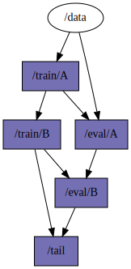
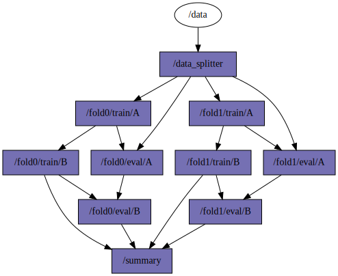
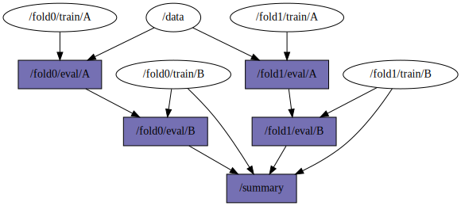
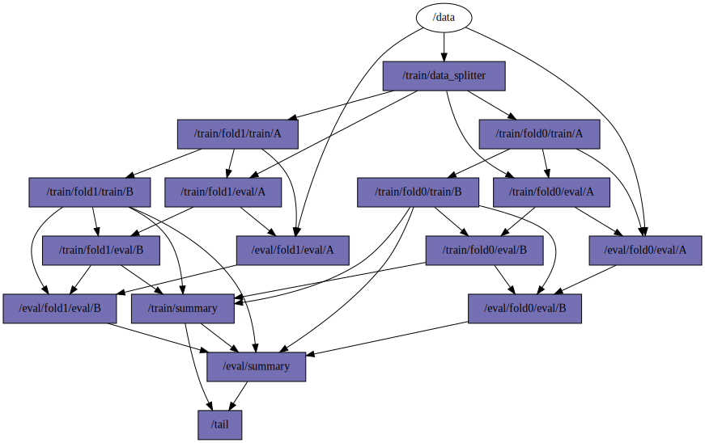

# Composable Pipelines

Pipelines should be modular to concatenate and stich together to be able to reuse functionality and
be flexible when building them.
But in addition to that they should also be composable.
Such capacity enables users to write down simple pipeline specification and then perform
complicated operations by adding nodes or repeating patterns to build more sophisticated and useful
ML pipelines.

Composing pipelines is not a trivial operation (we need to keep track of output to input
dependencies betwen steps!), and we have not found a library that does it either.
However, we have reached a nice solution that feels natural and general enough for ML use cases,
including building train and evaluation pipelines automatically, and combining them with
HPO (hyperparameter optimization), cross-validation, pseudolabelling.
This allows us to build larger and sophisticated step dependencies and perform more robust ML
experiments.

Furthermore, this ability is agnostic to any orchestration mechanism or library that can run the
pipeline, and it would be possible to adapt this language to different libraries, including Argo,
Airflow, AzureML, Kedro, etc.


## User specification

Let's assume we have tasks `A` and `B` that run sequentially and depend on some `data`.
A user would like to specify such dependencies, so they would would say that `A` requires input
`X`, that `X `is provided by `data`, and `B` depends on transformed output `X` from `A`.
This would be a very realistic scenario, but to simplify this exposition, let's drop the dependency
on `X`, and just assume that `data -> A` and `A -> B`.

The above is a linear graph, representing the computation dependencies between tasks (and we
omitted the data dependencies for simplicity).

In our framework to create the above graph a user could specify:

```python
nodes = {
    PipelineNode("A"): SomeNodeProviderA(),
    PipelineNode("B"): SomeNodeProviderB(),
}
edges: Dict[PipelineNode, Tuple[PipelineNode, ...]] = {
    PipelineNode("B"): (PipelineNode("A"),),
    PipelineNode("A"): (PipelineNode("data"),),
}

pipeline = Pipeline(nodes, edges)
```

If we draw the graph, this is what it would look like:


The `/` indicates the root namespace, which is a core feature that we are going to use to represent
composable nodes.


## Train and eval pipelines

Ideally, a user specifies the nodes and edges of a graph, and what each node executes.
Then, we assume that the ML pipeline contains train and evaluation steps, each with a different
executor.
We call combining the train and eval operations into a single object an Estimator, which is a term
acquired by [SparkML](https://spark.apache.org/docs/1.6.0/ml-guide.html).

For example, standardization step could require computing the mean and std of an input matrix, and
the evaluation step would require standardizing a test matrix given previous calculated mean and
std.
We assume that there are different algorithms for each step, and we want to combine them into a
single graph to identify where are the dependencies and what parts are parallelizable.

We could write
```python
pipeline0_train = Pipeline(train_nodes, edges)
pipeline0_eval = Pipeline(eval_nodes, edges)
```
to create a train and an eval pipeline, and get the following graph with dependencies:



In this example, `/train/A` can produce the mean and std for a holdout container that is evaluated
in `/eval/A` that also depends on `/data`.
Furthermore, `/train/B` still depends on the standardized output of `/train/A`, and similar idea
for `/eval/B` depending on `/eval/A`.
The outputs of both pipelines are gathered in `/tail`, which you can think as a placeholder.

Notice that we have created two new namespaces, `/train` and `/eval`, on top of the root `/`.

## Meta Estimators

Once we have a simple pipeline like the above, we may want to combine them or maybe compose them to
perform more complicated ML operations.
We refer to such composition strategies as meta-estimators, because they wrap over an estimator
pipeline, but still have training and evaluation parts.


### XValTrain

Cross-validation is an easy example to flush out this idea.
Consider the train sub-pipeline of cross-validation:

```python
xval_train = XValTrain(DataSplitter(num_folds=2), pipeline1).expand()
```

We are specifying a data-splitter with two folds, and provide the pipeline from the previous
section.
We expect that xval will create two folds running `pipeline1`, and a data-splitter before all
folds.
We also included a `/summary` node to process the outputs of the fold train and evaluation
pipelines.
If we plot `xval_train` pipeline, this is what we get:



Note again how the namespaces are expanded again, to point that some training is part of fold0, and
others part of fold1.
Similarly, there are nodes like `/data_splitter` and `summary` that remain in the root `/`
namespace.


### XValEval

The evaluation pipeline for a new test dataset is to pass through the differently trained models
from each fold, and then aggregating or processing the results.
There is no data splitting in this case.

We can generate the cross-validation eval pipeline by simply pruning the training parts from the
previous pipeline.

```python
xval_eval = XValEval(xval_train).prune()
```

We get the following graph:



Notice that the eval nodes keep a reference to the output of the training nodes, as they could be
providing a trained model, or any other training output.


### XVal Estimator

The whole train and eval pipelines can be combined into a single one with the previous operator.

```python
pipeline2 = Estimator(xval_train, xval_eval).expand()
```

The visualization results into




## Conclusion

The take away message is that pipelines are objects we can operate on, that we can concatenate or
compose.
The language that we use for doing these operations should abstract the user from getting right all
the output-inputs dependencies, compute resources or executors.

We have seen some complex pipelines being built just from a simple `data -> A -> B` dependency, and
we can expand the graph even further by using HPO or other meta-wrappers.
