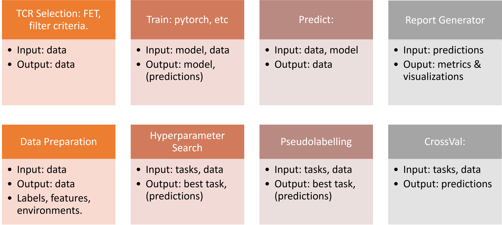
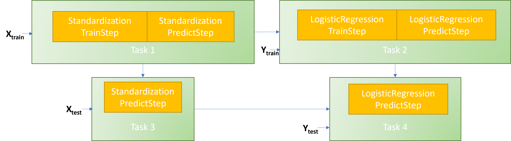
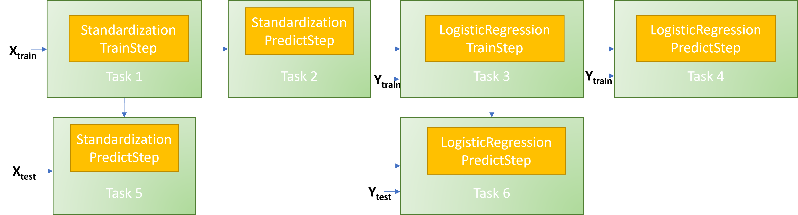
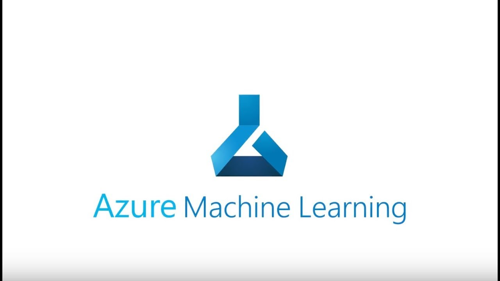

# Pipelines

There are many libraries that handle execution of tasks and present different features.
These libraries are normally used for software pipelines, e.g., ETL, CI/CD, etc, but can also be
used for machine learning (ML) tasks.
We are however not using these tools in our ML framework, and this limits our capacity to scale and
to improve our model learning procedures.

The focus for Rats is to introduce new frameworks that facilitate running flexible pipelines, that
scale our computation capabilities, that are usable by ML researchers, data scientists and
computational biologists, and that simplify reproducibility across experiments and environments.

We have identified some features that we would like our future framework to have:

* Modular: the experiments we run should involve a sequence of differentiated steps that we
reuse across experiment definitions, that we can concatenate and easily configure.
* Composable: many operations involve grouping sets of steps and performing operations on top,
such as cross-validation, train-valid dataset splits, or hyperparameter optimization (HPO).
* Distributed: steps should be able to run in the cluster on nodes only using the required
resources for each step, e.g., on GPU or powerful machines when required.
* Parallel: there are many tasks that can be parallelized to speed up the required time to run
experiments, for example intensive HPO and cross validation.
* Asynchronous & Synchronous: for most efficient use of cluster resources steps should not
communicate while running, nor deadlock resources while waiting.
However, a single task may communicate across nodes and have synchronous communication for specific
use cases if the library allows it, e.g., multiple-node FET selection running with Dask.
* Resilient: steps that fail due to cluster instabilities should restart and retry without crashing
the whole experiment.
* Reusable: we should reuse results from expensive tasks without repeating the computation.
* Schedulable: the framework should allow for efficient and fair use of resources without
compromising the cluster stability.

Furthermore, our framework and the interface that we provide should be agnostic to the libraries we
use to provide the above functionality.

## Use case examples:

The figure below lists some abstract tasks that we perform day to day and that we would like to
generalize and extend.
The experiments we run would benefit from becoming more modular and composable as the following
groups suggest, to become more easily parallelizable, scale more easily, and enable new
capabilities.

Note that at this point we have not listed any dependency on data, nor on the nature of the
experiment to run.
This is another core principle that we are not constraining the framework to a specific use case,
but to an agnostic framework that can be adapted to those use cases.
It will be the responsability of the users to compose the pipelines needed for their experiments.
There will not be any prescriptive way for composing such experiments.

However, it is unavoidable that in the ML pipeline there is always a training stage and a
validation stage when deploying real-world products.
We use the training stage to learn real-world behavior, and the evaluation stage to verify
real-world performance of our models as best as we can.

For this reason we provide some functionality to construct the train and evaluation pipelines
automatically, to facilitate the correct validation and automatation of experiments and analysis of
results.
[SparkML](https://spark.apache.org/docs/1.6.0/ml-guide.html) presents this functionality in what
they denoted as Estimators and Transformers.
We borrowed these concepts and incorporated them in Immunocam as well.
We will use them as well for Rats pipelines.

* Transformer: A Transformer is an algorithm which transforms or produces some data. For example,
standardization may shift and scale data given precalculated mean and std, or some model may
output binary predictions.
* Estimator: An Estimator is an algorithm which can be fit on data and produces a Transformer.
For example, computing the mean and std of some data and outputing a Transformer that
standardizes data, or training a model that later is used to make predictions.

Following these principles, we would like that if we specify an experiment such as
standardized-logistic-regression (SLR), where we first standardize the data, then we fit a model.
When we get data to evaluate the model we don't need to specify both procedures, but the pipeline
specifies a path for the training and evaluation pipelines   appropriately.

One way for doing this would be to draw the following graph with cronological dependencies, i.e.,
the prediction task cannot start until the model has been trained:

Alternatively, the pipeline could have been broken as below.
Both forms are equivalent and produce the same results, it is just a matter of grouping of
operations, and maybe of performance.

Generally, this Estimator-Transformer SLR example repeats itself in all ML tasks, including
HPO, cross-validation, pseudolabelling and other simple pipelines.
But apart from SparkML, we don't know of other libraries that use this paradigm.
Furthermore, we don't know of any library that supports composability of steps within the ML world.

What we would like to do next is present some libraries actively developed and/or popular, and
discuss which ones we could use/leverage for our purposes.
Feel free to contact us to talk about any tool you have used before or think it would be cool to
use.

## Existing Libraries

### Argo

Argo is one of the most popular libraries for pipelines in the ML and software worlds.
It is open source, runs on Kubernetes and it is widely used.
They support running
[1,000s of workflows with 10,000s steps a day](https://argoproj.github.io/argo-workflows/running-at-massive-scale/)
in well optimized clusters.

It supports many of the features that we described above, being running steps modularly,
distributed, parallel, and asynchronously.
It seems to be very efficient, defines simple concepts to understand, and it is written in golang.
Furthermore, it comes with a web service to visualize workflows, inspect logs, schedule tasks, etc.

However, it uses yaml files to configure any workflows or experiment in the cluster. This makes it
less user friendly than what we would have hoped.
Luckily, there exists side projects like [Hera](https://github.com/argoproj-labs/hera-workflows),
that provide a Python SDK to help generate those yaml files and interact with the cluster more
easily.

It also has a [plugin system](https://argoproj.github.io/argo-workflows/plugin-directory/),
and we hope that one day we can add a [scheduling mechanism](https://volcano.sh/en/) into it to
even get more features out of it.

After some scoping from other libraries, Argo seems to be one of the most promising and easy to use
pipeline systems, and having a simple Python SDK available, even easier to integrate.

### Airflow

Airflow is a very popular library for workflow ecosystems too, supporting batch workflows involving
directed-acyclic-graphs (DAGs) of steps.
However, in comparison to Argo seems to be lacking some important features.
It can create pod resources in Kubernetes, but not other resources, as Argo can, which is built
on top of Kubernetes itself.
Airflow cannot handle dynamic DAGs, whereas Argo can, which may be a limiting feature in the
future.

There are other comparisons, e.g.,
[post1](https://hevodata.com/learn/argo-vs-airflow/#:~:text=Argo%20and%20Airflow%20both%20allow,use%20Argo%20for%20your%20tasks.),
[post2](https://github.com/argoproj/argo-workflows/issues/849),
[post3](https://medium.com/arthur-engineering/picking-a-kubernetes-orchestrator-airflow-argo-and-prefect-83539ecc69b),
[post4](https://www.datarevenue.com/en-blog/airflow-vs-luigi-vs-argo-vs-mlflow-vs-kubeflow#:~:text=Airflow%20is%20an%20Apache%20project,learning%20how%20to%20use%20it.),
[post5](https://medium.com/the-prefect-blog/why-not-airflow-4cfa423299c4)
with more details, but it seems that Argo is the most recommended option.

Alternatives to these two orchestrators include Luigi and Prefect.
We already know Luigi and the software team knows its limitations best.
On the other hand, [Prefect](https://www.prefect.io/) is very well regarded but it is commercial.
It looks like Prefect relies on a Hybrid Model, where Prefect Core is an open source library to
define workflows and run them, but all features like UI, database, permissions, etc. is managed
on propietary software in their Cloud.

### AzureML

AzureML has a Pipelines module that it is quite versatile in running scripts and commnands.
It runs on top of Kubernetes and we believe it is also compatible with Argo, i.e., Argo
workflows can be run in AKS and those runs be displayed in AzureML.

What stands apart from AzureML pipelines is their SDK for Python.
They have built language support that allows to specify steps with dependencies, and those steps be
orchestrated by Kubernetes.
They also support handling intermediate results between steps by defining specific output types and
orchestrating communication between nodes and storage.

In summary, AzureML is a viable solution to implement our solution on top of, similar to Argo or
Airflow.
In fact, our goal is to build a library for building ML pipelines that supports our required
computations by levaraging existing tools that would handle the lower level orchestration.
However, AzureML Pipelines is dependent on Python as a language to specify an ML pipeline, whereas
Argo is language agnostic.
Furthermore, [Hera](https://github.com/argoproj-labs/hera-workflows) as a Python SDK is simpler in
our opinion than AzureML Pipelines.

### Kubeflow

Kubeflow is platform built on top of Kubernetes by Google to provide ML functionality, similar in a
way to AzureML, by incorporating many services together.
Some of these services include an experiment Dashboard, jupyterlab, a Python SDK for pipeline
specification, HPO plugin called Katib, as well as other features such as multi-tenancy for users,
etc.

Kubeflow Pipelines use Argo Workflows to provide Pipelines support.
The novelty they provide is a novel Python SDK, but we did not find it easy at all to understand,
and he have found [Hera](https://github.com/argoproj-labs/hera-workflows) much more approachable
and clear.
Therefore, Argo in conjunction with Hera seem like a better choice, and also it is not more
featured than AzureML at the current time.

On the other hand, [Katib](https://github.com/kubeflow/katib) seems like a very well developed
project supporting Kubernetes native hyperparameter optimization, and something to look out for.
We hope we will be able to provide Katib integration in the future, as it is compatible with Argo,
Tekton, and implements a ton of HPO algorithms as well as AutoML functionality.
To implement the algorithms functionality it relies on well-known ML libraries such as
[GOptuna](https://github.com/c-bata/goptuna),
[Hyperopt](https://github.com/hyperopt/hyperopt), or
[Chocolate](https://github.com/AIworx-Labs/chocolate).

### Kedro

[Kedro](https://github.com/kedro-org/kedro) is a popular framework to orchestrate workflows
natively in Python.
It is developed by Quantum Black (McKinsey), it is open-sourced, and it's aim is to help organize
ML projects easily, their repo structure, pipelines, documentation and library packaging.
Pipeliens can run in a single node, possibly with parallel threads, and more recently they released
plugins to translate their pipelines into Airflow and Argo.
It seems to us that such plugins can be regarded as a Python SDK to connect with Argo or Airflow.

Kedro has also introduced
[modular pipelines](https://kedro.readthedocs.io/en/stable/nodes_and_pipelines/modular_pipelines.html)
recently (in May 2022), a concept to group steps together and make them more portable.
They also introduced
[namespaces](https://kedro.readthedocs.io/en/stable/tutorial/namespace_pipelines.html)
to make sub-pipelines reusable allowing different inputs/outputs but same executors.

As a whole, Kedro is a very interesting project.
It includes ideas for data loading and pre-processing, pipeline orchestration, and repository
management.
However, their pipeline framework is not yet built with composability in mind.
They do not support wrapping simple pipelines over cross-validation, pseudolabelling or HPO,
and we would still require Argo or Airflow to run things at scale.

Furthermore, we would have limitations to use different Docker images in the same pipeline, one
with Spark and another with Pytorch.
Overall, Kedro does not yet support the ML concepts we need to support to speed up our research
process.
Finally, it would be as complicated to build the ML concepts we need on top of Kedro as it is to
build them on top of Argo directly.

### NextFlow

[Nextflow](https://www.nextflow.io/) is built to support data science pipelines, by orchestrating
the execution of (shell) scripts.
A user organizes their steps in scripts, specify input and outputs entries, compute resources, and
then launches the workflow.

The library submits jobs to kubernetes, uses Docker to run these processess and orchestrates the
whole sequence of steps.
However, even though it has asynchronous communication support between processes, we did not find
any reference to running in multiple machines.
It seems that the library is constrained to run in a single node, limiting our scalability
capabilities.

### SnakeMake

[Snakemake](https://snakemake.github.io/) follows the GNU Make paradigm: workflows are defined in
terms of rules that define how to create output files from input files.
Dependencies between the rules are determined automatically, creating a DAG of jobs that can be
automatically parallelized.

Basically, a user needs to define steps with input and output entries as well as an executable.
The library figures the dependencies graph and runs the tasks appropriately.
Snakemake can run in single machines or Kubernetes cluster, but in the second case all storage
is centralized via a central node.
This seems to be much less powerful than Argo.

## Conclusion

Argo seems to be the most powerful, versatile and recommended tool among the ones we have analyzed.
Airflow looks second best, but it has certain limitations regarding fast executing workflows or
dynamic dags.
Hera Python SDK can help us interface with Argo easily and avoid writing configuration files
directly.

Prefect seemed like a popular choice because it gives free individual use, but it is commercial and
relies on a propietary server side for UI and databases.

AzureML and Kubeflow either rely on Kubernetes for orchestrating pipelines or Argo, respectively,
and they only provide Python SDKs.
Similarly, Kedro can run locally or in Kubernetes, but when running on Kubernetes it requires
using it's own Python SDK as well.
The problem with these solutions is that they do not provide the ML functionality we require.

NextFlow and Snakemake run in either a single machine, require a single filesystem
managed cluster, or centralized storage, which may work for small projects, but not when one of our
compromises is scalability.

Finally, none of these libraries support the composability that we require, including
the Estimator & Transformer framework to construct automatic train and evaluation pipelines, nor
ML concepts that wrap over small pipelines, such as HPO, cross-validation or pseudolabelling.
These are the features that leveraged with fitting compute resources will allow us to reduce costs
and speed up our research processes.
