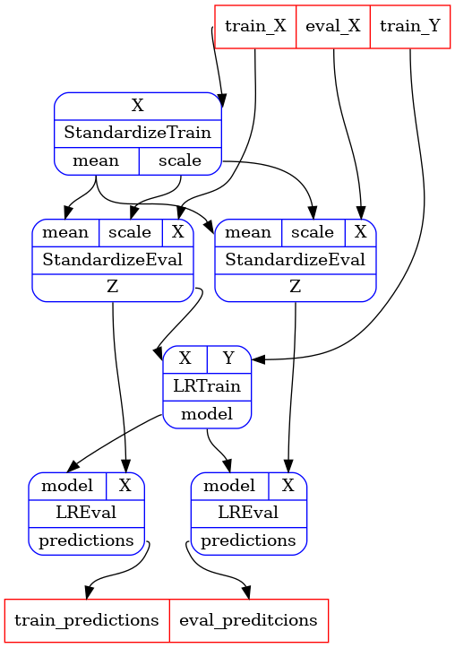

# Internship project - Computation Graphs as Delayed Functions

## Background

Consider a computation graph described as a directed port graph G with nodes and edges. The graph
represents the execution order and required information to run a computation in a platform of
interest, e.g., Azure Kubernetes Service (AKS), Azure Machine Learning (AML), Argo, Kubeflow,
Airflow, etc.

Nodes have input and output ports and encapsulate computations transforming inputs taken from input
ports to outputs fed to output ports. Edges represent the connections from output to input ports
across nodes.

An orchestrator receives a computation graph and manages the execution of nodes and the passing of
data from output ports to input ports as required. An orchestrator runs a graph G on a single or
multiple machines, in parallel or sequentially.

This internship proposal is part of Rats, a Health Futures effort to build a python library for
defining and executing computational graphs for machine learning.

## Goal of internship

Computation graphs represent delayed calls to functions.

There are multiple ways to define it in Rats, but they all boil down to manipulating nodes and
edges.

The goal of this internship is to support defining the graph by simply writing functions.

Consider, for example the following computation graph, describing a standardized logistic
regression trained on train data and predicting on holdout data:



We should be able to produce this graph using code similar to the following:

```python
std_train = delayed_func(StandardizeTrain)
std_eval = delayed_func(StandardizeEval)
lr_train = delayed_func(LRTrain)
lr_eval = delayed_func(LREval)


def std(train_X, eval_X):
    std_params = std_train(train_X)
    train_Z = std_eval(train_Z, **std_params)
    eval_Z = std_eval(eval_Z, **std_params)
    return Munch(train_Z=train_X, eval_Z=eval_Z)


def lr(train_X, train_Y, eval_features):
    lr_params = lr_train(train_X, train_Y)
    train_predictions = lr_eval(train_X, **lr_params)
    eval_predictions = lr_eval(eval_features, **lr_params)
    return Munch(train_predictions=train_predictions, eval_predictions=eval_predictions)


def std_lr(train_X, train_Y, eval_X):
    std_res = std(train_X, eval_X)
    res = lr(train_X=std_res.train_Z, train_Y=train_Y, eval_X=std_res.eval_Z)
    return res


g = get_graph_from_delayed_func(std_lr)
```

## Impact

A successful design and implementation would simplify the definition of Rats computation graphs.
It would improve readability, testability and sharability of code defining computation graphs.

There would be a distinct gain if the implementation manages to handle static typing for
`delayed_func`, which might require writing a mypy plugin. Consider type checking of edges, i.e.
verifying that the type associated with the output port of the upstream node is compatible with the
type associated with the input port of the downstream port.  Currently we can only perform this
verification at run time.  This project would enable static type checkers to perform it, as well as
unleash other benefits that depend on static type analysis, such as auto-completion in IDEs.

## Details

Key components of a solution would include the following concepts:

1. A DataProxy represents data flowing in to input ports and out of output ports.  It is generic on
    the data type.  There are two flavours to a DataProxy:
    1. InputDataProxy represents input to the compute graph.
    1. CalculatedDataProxy represents data produced by a graph node. It holds a reference to a Node
       and the name of one of the outputs of the node's function.
1. A Node holds a function and the function's inputs as DataProxy objects.
1. A delayed function is any function taking DataProxy objects and returning DataProxy objects.
    1. A single-node delayed function, created by wrapping a function with `delayed_func` holds the
       function.  When called, it creates a Node (from its inputs and the function it holds), and
       returns a CalculatedDataProxy object referencing the node for each output of the original
       function.
    1. Other delayed functions can be created by calling existing delayed functions, as examplified
       by `std`, `lr` and `std_lr` above.
1. Given a delayed function, we can create a graph by passing an InputDataDataProxy as each one of
   its inputs and analysing the CalculatedDataProxy objects it returns.

Detailed design is part of the internship task.

## Requirements

Good coding skills.

An interest in programming languages.

Bonus: Education or experience in programming languages theory.

## Proposed plan

Week 1-2: Onboarding, problem understanding, literature review.

Week 3-4: Design and implementation of prototype, with no static typing support.

Week 5-6: Learning about python's static typing, mypy plugin system, etc.  Redesign, including
          static typing support.

Week 7-8: Production quality implementation.

Week 9-10: Working with users to incorporate added functionality into their code bases.

Week 10-12: Documentation, tutorials and final report.
