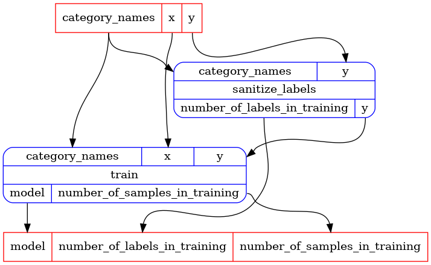
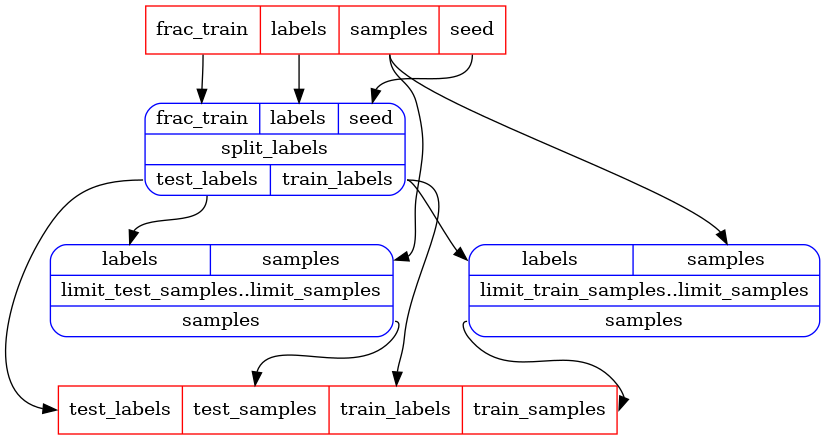
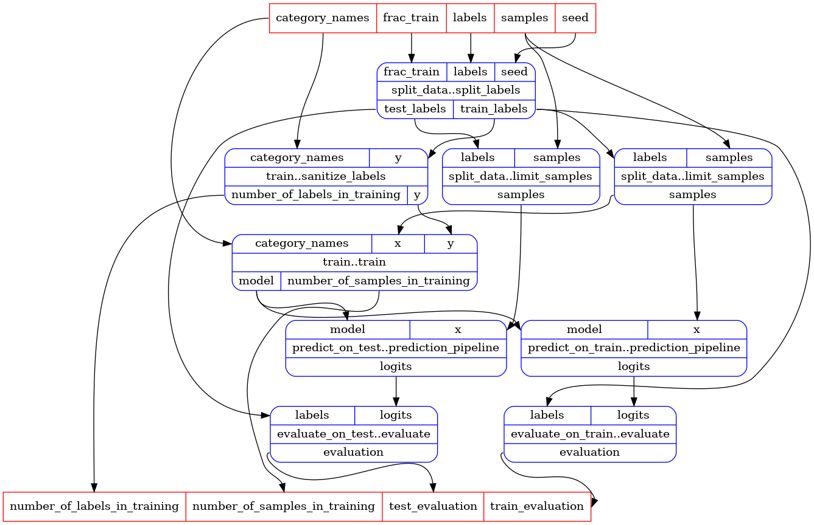

```python
# type: ignore
# there are multiple typing issues in pandas and the iris dataset, easier to disable typing for
# this notebook
```

So far we have learned how to create self-contained pipelines in a single container class.

In this notebook we will learn how to expose and use pipelines across containers.


### Using pipelines defined in installed packages.

The LR pipelines we have defined in [the previous notebook](lr_using_sklearn.md) are also
defined in `rats.examples-sklearn`, and exposed as `rats.apps` *Services*.  We will start by
showing how to access these pipelines from the app.  For an e2e documentation of `rats.apps` and
its concept of *Services* see [The `rats.apps` documentation](../../../rats-apps/).

Here we will show how to access the pipelines exposed as services by `rats.examples-sklearn`,
how to integrate them as sub-pipelines of a new pipeline, and how to expose other pipelines as
services.


```python
from typing import NamedTuple, cast

import pandas as pd

from rats import apps
from rats import processors as rp
from rats.examples_sklearn import Services as ExampleServices
from rats.processors import typing as rpt
```

To expose a service using the `rats.apps`, the service author creates a service id and exposes it
in a public class.  In the case of `rats.examples-sklearn`, that class is `ExampleServices`
imported above.  A recommended pattern is to include the service ids as class properties,
using CAPS_WITH_UNDERSCORES for the property names.


```python
[p for p in dir(ExampleServices) if not p.startswith("_")]
```


_cell output_:
```output
['PREDICT_PIPELINE', 'TRAIN_PIPELINE']
```


All of these properties are `ServiceId` instances, which can be used to get services from
service containers and apps.

We get the pipelines by passing the relevant service id to `app.get`.  This is possible because
the containers that define these services are registered with the app.  More on that later.


```python
app = rp.NotebookApp()
train_pipeline = app.get(ExampleServices.TRAIN_PIPELINE)
print("train pipeline input ports:", train_pipeline.inputs)
print("train pipeline output ports:", train_pipeline.outputs)
app.display(train_pipeline)
```
_cell output_:
```output
train pipeline input ports: InPorts(category_names=InPort[collections.abc.Sequence[str]], y=InPort[pandas.core.series.Series], x=InPort[pandas.core.frame.DataFrame])
train pipeline output ports: OutPorts(number_of_labels_in_training=OutPort[int], model=OutPort[rats.examples_sklearn._lr_pipeline_container.LRModel], number_of_samples_in_training=OutPort[int])
```





Note:
Like all services, in a statically typed environment, the service ids carry the static type of
the service they represent.  Here, train_pipeline is of static type
`Pipeline[TrainPipelineInputs, TrainPipelineOutputs]`.

### Registering a container with the notebook app.

The mechanisms for registering containers to apps are different when registering in a notebook
versus in a package.  We will discuss both below.

To illustrate registering a container to an app in a notebook we will create a new container
with a pipeline for splitting a dataframe into training and testing sets.

To illustrate using registered pipeline services as sub-pipelines, we will create yet another
container that combines the new `split_data` pipeline, as well as `train_pipeline` and
`predict_pipeline` into a `train_and_predict_pipeline`.

But first the `split_data` pipeline container:


```python
class _SplitLabelsOutput(NamedTuple):
    train_labels: pd.Series
    test_labels: pd.Series


class _LimitSamplesOutput(NamedTuple):
    samples: pd.DataFrame


class SplitDataInputs(rpt.Inputs):
    frac_train: rpt.InPort[float]
    seed: rpt.InPort[int]
    labels: rpt.InPort[pd.Series]
    samples: rpt.InPort[pd.DataFrame]


class SplitDataOutputs(rpt.Outputs):
    train_samples: rpt.OutPort[pd.DataFrame]
    train_labels: rpt.OutPort[pd.Series]
    test_samples: rpt.OutPort[pd.DataFrame]
    test_labels: rpt.OutPort[pd.Series]


SplitDataPl = rpt.Pipeline[SplitDataInputs, SplitDataOutputs]


class SplitDataPipelineContainer(rp.PipelineContainer):
    @rp.task
    def split_labels(
        self, frac_train: float, seed: int, labels: pd.Series
    ) -> _SplitLabelsOutput:
        train_indices = labels.sample(frac=frac_train, random_state=seed).index
        train_labels = labels.loc[train_indices]
        test_labels = labels.drop(train_indices)
        return _SplitLabelsOutput(
            train_labels=train_labels,
            test_labels=test_labels,
        )

    @rp.task
    def limit_samples(
        self, labels: pd.Series, samples: pd.DataFrame
    ) -> _LimitSamplesOutput:
        return _LimitSamplesOutput(samples=samples.loc[labels.index])

    @rp.pipeline
    def limit_train_samples(self) -> rpt.UPipeline:
        # create a copy of limit_samples with inputs and outputs renamed to indicated that it is
        # to be used for train.
        return (
            self.limit_samples()
            .rename_inputs(dict(labels="train_labels"))
            .rename_outputs(dict(samples="train_samples"))
        )

    @rp.pipeline
    def limit_test_samples(self) -> rpt.UPipeline:
        # create a copy of limit_samples with inputs and outputs renamed to indicated that it is
        # to be used for test.
        return (
            self.limit_samples()
            .rename_inputs(dict(labels="test_labels"))
            .rename_outputs(dict(samples="test_samples"))
        )

    @rp.pipeline
    def split_data(self) -> SplitDataPl:
        split_labels = self.split_labels()
        limit_train_samples = self.limit_train_samples()
        limit_test_samples = self.limit_test_samples()
        return cast(
            SplitDataPl,
            self.combine(
                pipelines=[split_labels, limit_train_samples, limit_test_samples],
                dependencies=(
                    split_labels >> limit_train_samples,
                    split_labels >> limit_test_samples,
                ),
                # We want to expose train_labels and test_labels, but they are already consumed by
                # limit_train_samples and limit_test_samples, so are not exposed by default.
                # Therefore we need to provide the outputs explicitly.
                outputs=dict(
                    train_samples=limit_train_samples.outputs.train_samples,
                    test_samples=limit_test_samples.outputs.test_samples,
                    train_labels=split_labels.outputs.train_labels,
                    test_labels=split_labels.outputs.test_labels,
                ),
            ),
        )
```

We want to make the split-data pipeline available to other containers. To that end, we need to
expose a service id for the pipeline in public class:


```python
class SplitDataServices:
    LR_SPLIT_DATA_PIPELINE = apps.autoid(SplitDataPipelineContainer.split_data)
```

We also need to register `SplitDataPipelineContainer` with the app. In a notebook, registering a
pipeline container with the app requires re-creating the app instance, passing a callable taking
a container and returning a container to its constructor.  The app will pass itself to that
callable, and register the returned container with itself.

Much easier to understand from code:


```python
app = rp.NotebookApp(lambda app: SplitDataPipelineContainer())
split_data_pipeline = app.get(SplitDataServices.LR_SPLIT_DATA_PIPELINE)
print("split data pipeline input ports:", split_data_pipeline.inputs)
print("split data pipeline output ports:", split_data_pipeline.outputs)
app.display(split_data_pipeline)
```
_cell output_:
```output
split data pipeline input ports: InPorts(frac_train=InPort[float], seed=InPort[int], labels=InPort[pandas.core.series.Series], samples=InPort[pandas.core.frame.DataFrame])
split data pipeline output ports: OutPorts(train_samples=OutPort[pandas.core.frame.DataFrame], test_samples=OutPort[pandas.core.frame.DataFrame], train_labels=OutPort[pandas.core.series.Series], test_labels=OutPort[pandas.core.series.Series])
```





### Using pipelines registered with the app as sub-pipelines in another container.

As promised, we will now create a container that uses `split_data_pipeline`, `train_pipeline`
and `predict_pipeline` to create a `train_and_predict_pipeline`.

Our new container will need access to the app, and hence will take it in its constructor. Note
that the app itself is a container, and to be general, we will use the `apps.Container` type.

Note that we wrap each external sub-pipeline with a `@pipeline` method.  This ensures that these
pipelines are distincly named within the context of the container.


```python
class _EvaluateOutput(NamedTuple):
    evaluation: pd.DataFrame


class TrainAndPredictPipelineContainer(rp.PipelineContainer):
    _app: apps.Container

    def __init__(self, app: apps.Container):
        super().__init__()
        self.app = app

    @rp.pipeline
    def split_data(self) -> rpt.UPipeline:
        return self.app.get(SplitDataServices.LR_SPLIT_DATA_PIPELINE)

    @rp.pipeline
    def train(self) -> rpt.UPipeline:
        return self.app.get(ExampleServices.TRAIN_PIPELINE).rename_inputs(
            dict(x="train_samples", y="train_labels")
        )

    @rp.pipeline
    def predict_on_train(self) -> rpt.UPipeline:
        return (
            self.app.get(ExampleServices.PREDICT_PIPELINE)
            .rename_inputs(dict(x="train_samples"))
            .rename_outputs(dict(logits="train_logits"))
        )

    @rp.pipeline
    def predict_on_test(self) -> rpt.UPipeline:
        return (
            self.app.get(ExampleServices.PREDICT_PIPELINE)
            .rename_inputs(dict(x="test_samples"))
            .rename_outputs(dict(logits="test_logits"))
        )

    @rp.task
    def evaluate(self, logits: pd.DataFrame, labels: pd.Series) -> _EvaluateOutput:
        evaluation = (
            logits.join(labels).groupby(labels.name).agg(["mean", "std", "count"])
        )
        return _EvaluateOutput(evaluation=evaluation)

    @rp.pipeline
    def evaluate_on_train(self) -> rpt.UPipeline:
        return (
            self.evaluate()
            .rename_inputs(dict(logits="train_logits", labels="train_labels"))
            .rename_outputs(dict(evaluation="train_evaluation"))
        )

    @rp.pipeline
    def evaluate_on_test(self) -> rpt.UPipeline:
        return (
            self.evaluate()
            .rename_inputs(dict(logits="test_logits", labels="test_labels"))
            .rename_outputs(dict(evaluation="test_evaluation"))
        )

    @rp.pipeline
    def train_and_predict_pipeline(self) -> rpt.UPipeline:
        split_data = self.split_data()
        train = self.train()
        predict_on_train = self.predict_on_train()
        predict_on_test = self.predict_on_test()
        evaluate_on_train = self.evaluate_on_train()
        evaluate_on_test = self.evaluate_on_test()
        return self.combine(
            pipelines=[
                split_data,
                train,
                predict_on_train,
                predict_on_test,
                evaluate_on_train,
                evaluate_on_test,
            ],
            dependencies=(
                split_data >> train,
                split_data >> predict_on_train,
                split_data >> predict_on_test,
                split_data >> evaluate_on_train,
                split_data >> evaluate_on_test,
                train >> predict_on_train,
                train >> predict_on_test,
                predict_on_train >> evaluate_on_train,
                predict_on_test >> evaluate_on_test,
            ),
        )
```

Again, we create a service id for the pipeline we want to expose:


```python
class TrainAndPredictPipelineServices:
    LR_TRAIN_AND_PREDICT_PIPELINE = apps.autoid(
        TrainAndPredictPipelineContainer.train_and_predict_pipeline
    )
```

We'll recreate the app again, this time registering both `SplitDataPipelineContainer` and
`TrainAndPredictPipelineContainer`.


```python
app = rp.NotebookApp(
    lambda app: SplitDataPipelineContainer(),
    TrainAndPredictPipelineContainer,  # no need to wrap with lambda b/c the ctor takes an app
)
```


```python
train_and_predict_pipeline = app.get(
    TrainAndPredictPipelineServices.LR_TRAIN_AND_PREDICT_PIPELINE
)
print("train and predict pipeline input ports:", train_and_predict_pipeline.inputs)
print("train and predict pipeline output ports:", train_and_predict_pipeline.outputs)
app.display(train_and_predict_pipeline)
```
_cell output_:
```output
train and predict pipeline input ports: InPorts(frac_train=InPort[float], seed=InPort[int], labels=InPort[pandas.core.series.Series], samples=InPort[pandas.core.frame.DataFrame], category_names=InPort[collections.abc.Sequence[str]])
train and predict pipeline output ports: OutPorts(number_of_labels_in_training=OutPort[int], number_of_samples_in_training=OutPort[int], train_evaluation=OutPort[pandas.core.frame.DataFrame], test_evaluation=OutPort[pandas.core.frame.DataFrame])
```





Let's load the iris data and run!


```python
from sklearn import datasets

iris = datasets.load_iris()
category_names = tuple(iris["target_names"])

samples = pd.DataFrame(iris["data"], columns=iris["feature_names"])
labels = pd.Series(iris["target"], name="label").map(lambda i: category_names[i])

train_and_predict_outputs = app.run(
    train_and_predict_pipeline,
    inputs=dict(
        frac_train=0.8,
        seed=6001986,
        labels=labels,
        samples=samples,
        category_names=category_names,
    ),
)
```

Train evaluation:


```python
train_and_predict_outputs["train_evaluation"]
```


<div>
<style scoped>
    .dataframe tbody tr th:only-of-type {
        vertical-align: middle;
    }

    .dataframe tbody tr th {
        vertical-align: top;
    }

    .dataframe thead tr th {
        text-align: left;
    }

    .dataframe thead tr:last-of-type th {
        text-align: right;
    }
</style>
<table border="1" class="dataframe">
  <thead>
    <tr>
      <th></th>
      <th colspan="3" halign="left">setosa</th>
      <th colspan="3" halign="left">versicolor</th>
      <th colspan="3" halign="left">virginica</th>
    </tr>
    <tr>
      <th></th>
      <th>mean</th>
      <th>std</th>
      <th>count</th>
      <th>mean</th>
      <th>std</th>
      <th>count</th>
      <th>mean</th>
      <th>std</th>
      <th>count</th>
    </tr>
    <tr>
      <th>label</th>
      <th></th>
      <th></th>
      <th></th>
      <th></th>
      <th></th>
      <th></th>
      <th></th>
      <th></th>
      <th></th>
    </tr>
  </thead>
  <tbody>
    <tr>
      <th>setosa</th>
      <td>-0.029188</td>
      <td>0.014851</td>
      <td>38</td>
      <td>-3.670705</td>
      <td>0.503186</td>
      <td>38</td>
      <td>-16.486649</td>
      <td>1.064447</td>
      <td>38</td>
    </tr>
    <tr>
      <th>versicolor</th>
      <td>-4.399189</td>
      <td>1.247193</td>
      <td>41</td>
      <td>-0.185309</td>
      <td>0.193948</td>
      <td>41</td>
      <td>-2.715690</td>
      <td>1.370153</td>
      <td>41</td>
    </tr>
    <tr>
      <th>virginica</th>
      <td>-10.300958</td>
      <td>2.936240</td>
      <td>41</td>
      <td>-2.831081</td>
      <td>1.483676</td>
      <td>41</td>
      <td>-0.157054</td>
      <td>0.204131</td>
      <td>41</td>
    </tr>
  </tbody>
</table>
</div>


Test evaluation:


```python
train_and_predict_outputs["test_evaluation"]
```


<div>
<style scoped>
    .dataframe tbody tr th:only-of-type {
        vertical-align: middle;
    }

    .dataframe tbody tr th {
        vertical-align: top;
    }

    .dataframe thead tr th {
        text-align: left;
    }

    .dataframe thead tr:last-of-type th {
        text-align: right;
    }
</style>
<table border="1" class="dataframe">
  <thead>
    <tr>
      <th></th>
      <th colspan="3" halign="left">setosa</th>
      <th colspan="3" halign="left">versicolor</th>
      <th colspan="3" halign="left">virginica</th>
    </tr>
    <tr>
      <th></th>
      <th>mean</th>
      <th>std</th>
      <th>count</th>
      <th>mean</th>
      <th>std</th>
      <th>count</th>
      <th>mean</th>
      <th>std</th>
      <th>count</th>
    </tr>
    <tr>
      <th>label</th>
      <th></th>
      <th></th>
      <th></th>
      <th></th>
      <th></th>
      <th></th>
      <th></th>
      <th></th>
      <th></th>
    </tr>
  </thead>
  <tbody>
    <tr>
      <th>setosa</th>
      <td>-0.034005</td>
      <td>0.010494</td>
      <td>12</td>
      <td>-3.456574</td>
      <td>0.385791</td>
      <td>12</td>
      <td>-16.214229</td>
      <td>0.796136</td>
      <td>12</td>
    </tr>
    <tr>
      <th>versicolor</th>
      <td>-4.743202</td>
      <td>1.759305</td>
      <td>9</td>
      <td>-0.246362</td>
      <td>0.227132</td>
      <td>9</td>
      <td>-2.572609</td>
      <td>1.721434</td>
      <td>9</td>
    </tr>
    <tr>
      <th>virginica</th>
      <td>-10.123276</td>
      <td>3.054774</td>
      <td>9</td>
      <td>-2.602026</td>
      <td>1.499988</td>
      <td>9</td>
      <td>-0.208703</td>
      <td>0.252439</td>
      <td>9</td>
    </tr>
  </tbody>
</table>
</div>


### Registering containers in packages.
As mentioned above, the mechanism for registering containers defined in a package (i.e. in your
repo) with the `rats.processors` apps is different.

#### Registering a container within another container using the `@container` decorator.
The `@container` decorator allows a container to include other containers as sub-containers. A
`.get(service_id)` call on the container will search it and all the containers it includes via a
`@container` decorator.

For example, we could create another container class that includes `SplitDataPipelineContainer`
and `TrainAndPredictPipelineContainer` as sub-containers, and register that other container class
with the app.  Functionally, this is the same as what we did above:


```python
class C1(apps.AnnotatedContainer):
    _app: apps.Container

    def __init__(self, app: apps.Container) -> None:
        super().__init__()
        self._app = app

    @apps.container()
    def split_data(self) -> SplitDataPipelineContainer:
        return SplitDataPipelineContainer()

    @apps.container()
    def train_and_predict(self) -> TrainAndPredictPipelineContainer:
        return TrainAndPredictPipelineContainer(self._app)


app = rp.NotebookApp(C1)

train_and_predict_pipeline = app.get(
    TrainAndPredictPipelineServices.LR_TRAIN_AND_PREDICT_PIPELINE
)
print("train and predict pipeline input ports:", train_and_predict_pipeline.inputs)
print("train and predict pipeline output ports:", train_and_predict_pipeline.outputs)
app.display(train_and_predict_pipeline)
```
_cell output_:
```output
train and predict pipeline input ports: InPorts(frac_train=InPort[float], seed=InPort[int], labels=InPort[pandas.core.series.Series], samples=InPort[pandas.core.frame.DataFrame], category_names=InPort[collections.abc.Sequence[str]])
train and predict pipeline output ports: OutPorts(number_of_labels_in_training=OutPort[int], number_of_samples_in_training=OutPort[int], train_evaluation=OutPort[pandas.core.frame.DataFrame], test_evaluation=OutPort[pandas.core.frame.DataFrame])
```


We recommend using this mechanism to create a top level container for every package.
For example, this tutorial is coded in a package rats.examples-sklearn (look for it in the [RATS
github repo](https://github.com/microsoft/rats/)).  That package includes a private
`rats.examples_sklearn._plugin_container.PluginContainer` that includes all other containers in
the package.

#### Registering containers to the app via the python `entry_points` mechanism.

We want to enable client packages (like yours) to register their services with the
`rats.processors` app classes (`NotebookApp`, `CliApp`).  Obviously, the app classes in
`rats.processors` cannot know of specific client packages.  Instead, `rats.processors` exposes a
python [entry point](https://docs.python.org/3/library/importlib.metadata.html#entry-points)
group for client packages to register their containers with. The `rats.processors` app classes
interact with the python entry point mechanism to discover these container classes and register
them as sub-containers of the app.

The entry point group used by `rats.processors` apps is "rats.processors_app_plugins".

Using `poetry` and `pyproject.toml`, you can register your container classes with the apps by
adding the following to your `pyproject.toml`:
```
[tool.poetry.plugins."rats.processors_app_plugins"]
"my_package" = "my_package.my_module:MyContainer"
```
The only two requirements are that `my_package.my_module.MyContainer` implements the
`apps.Container` interface (e.g. by inheriting from `apps.AnnotatedContainer` or
`rp.PipelineContainer`), and that its constructor takes an `apps.Container` as its only argument.

For example, in the `rats.examples-sklearn` package, we self register our top level container
like this:
```
[tool.poetry.plugins."rats.processors_app_plugins"]
"rats.processors" = "rats.examples_sklearn._plugin_container:PluginContainer"
```
