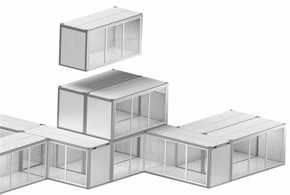
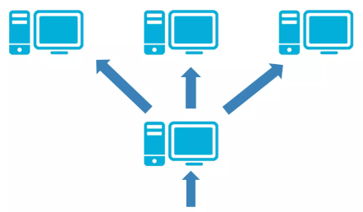
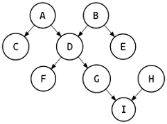

# rats-processors

A package to create and compose pipelines in a high level API, where _processors (classes
or unbound methods) are mapped into _pipeline nodes_, _node ports_ are inferred from the
_processors_ signature, and _edges_ are created by connecting _node ports_ inputs and outputs.
Pipelines defined this way are immutable objects that can be reused and composed into larger
pipelines, facilitating reusability.

## Example

In you python project or Jupyter notebook, you can compose a pipeline as follows:

```python
from typing import NamedTuple

from pathlib import Path

from sklearn.base import BaseEstimator
import pandas as pd
from rats.processors import task, pipeline, Pipeline, PipelineContainer


class DataOut(NamedTuple):
    data: pd.DataFrame


class DataOut(NamedTuple):
    model: BaseEstimator


class MyContainer(PipelineContainer):
    @task
    def load_data(self, fname: Path) -> DataOut:
        return DataOut(data=pd.read_csv(fname))

    @task
    def train_model(self, data: pd.DataFrame) -> ModelOut:
        return {"model": "trained"}

    @pipeline
    def my_pipeline(self) -> Pipeline:
        load_data = self.load_data()
        train_model = self.get(train_model)
        return self.combine(
            pipelines=[load_data, train_model],
            dependencies=(train_model.inputs.data << load_data.outputs.data),
        )
```

The above example helps with modularization and bringing exploratory code from notebooks to more
permanent code.

The example above illustrates already several important concepts:
* `rats.processors.PipelineContainer`: we wire up code modularly, i.e., one container organizes and
connects tasks and pipelines.
* `rats.processors.ux.Pipeline`: a data structure that represents a computation graph, or a
direct acyclic graph (DAG) of operations.
* `rats.processors.task`: a decorator to define a computational task, which we refer as _processor_
and register it into the container. The return value of this method is
`rats.processors.ux.Pipeline`, a (single-node) _pipeline_.
* `rats.processors.pipeline`: a decorator to register a `rats.processors.ux.Pipeline`,
which can be a combination of other pipelines, or any method that returns a pipeline.


Note that to create a pipeline, you first create _tasks_ (_processors_) and then combine them into
larger _pipelines_, e.g. `MyContainer.load_data` and `MyContainer.train_model` are _processors_
wrapped by the `task` decorator, and `MyContainer.my_pipeline` is a _pipeline_ wrapped by the
`pipeline` decorator.


To run the above pipeline, you can do the following:

```python
from rats.apps import autoid, NotebookApp


app = NotebookApp()
app.add(MyContainer())  # add a container to the notebook app
p = app.get(autoid(MyContainer.my_pipeline))  # get a pipeline by its id
app.draw(p)
app.run(p, inputs={"fname": "data.csv"})
```


## Concepts

| Concepts  | Description                                          |
|-----------|------------------------------------------------------|
| Pipelines | DAG organizing computation tasks                     |
|           | Orchestrated in run environments                     |
|           | Figure display                                       |
| Tasks     | Entry point for computation process                  |
|           | Accepts dynamic inputs/outputs                       |
| Combined  | Compose tasks & pipelines to draw more complex DAGs. |
|           | Dependency assignment                                |

## Features

| Features    |                                               |                                              |             |                                                     |                                              |
|-------------|-----------------------------------------------|----------------------------------------------|-------------|-----------------------------------------------------|----------------------------------------------|
| Modular     | Steps become independent;<br> Plug & play        |          | Distributed | Uses required resources (spark or GPUs)             |  |
| Graph-based | Can operate on the DAG;<br> Enables meta-pipelines |  | Reusable    | Every pipeline is shareable allowing collaborations |     |

## Goals

* Flexibility: multiple data sources; multiple ML frameworks (pytorch, sklearn, ...), etc.
* Scalability: both data and compute.
* Usability: everyone should be able to author components and share them.
* Reproducibility: Tracking and recreating results.
