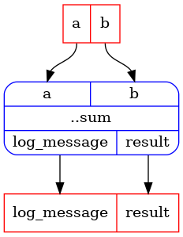
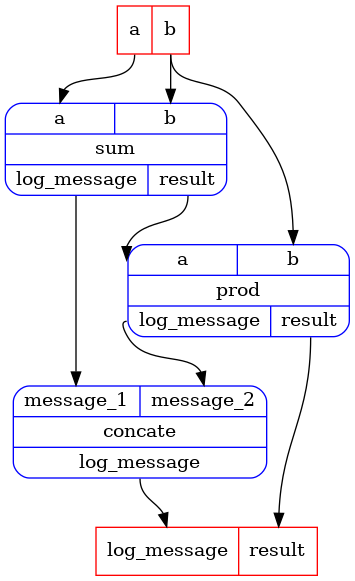

```python
from typing import NamedTuple

import rats.processors as rp
from rats.processors import typing as rpt

app = rp.NotebookApp()
```


A pipeline node holds a reference to a processor, i.e. the function that will be executed when
the node is run.

The processor function is expected to take annotated arguments and return a NamedTuple.  The
annotations will become the pipeline's inputs, and the entries of the NamedTuple will become the
pipeline's outputs.

To create a single node pipeline, create a class that inherits from `PipelineContainer` and
annotate a method with the `task` decorator.


```python
class _CalcOutput(NamedTuple):
    result: float
    log_message: str


class SimplePipelineContainer1(rp.PipelineContainer):
    @rp.task
    def sum(self, a: float, b: float) -> _CalcOutput:
        result = a + b
        log_message = f"{a} + {b} = {result}\n"
        return _CalcOutput(result=result, log_message=log_message)


spc1 = SimplePipelineContainer1()
```


The `task` decorator converts the method into a method that takes nothing and returns a pipeline.

Let's create the pipeline, and then inspect it.

We could graphically display the pipeline using `app.display`, however, displaying the pipeline
in a notebook requires a pre-installed `graphviz` package.  If it is not available on your
system, the following will result in an error message asking you to install it.


```python
sum_pipeline = spc1.sum()
print("Pipeline input ports:", sum_pipeline.inputs)
print("Pipeline output ports:", sum_pipeline.outputs)

app.display(sum_pipeline)
```
_cell output_:
```output
Pipeline input ports: InPorts(a=InPort[float], b=InPort[float])
Pipeline output ports: OutPorts(result=OutPort[float], log_message=OutPort[str])
```





To run the pipeline, call `app.run` with the pipeline and its inputs:


```python
outputs = app.run(
    sum_pipeline,
    inputs={
        "a": 1.0,
        "b": 2.0,
    },
)
```


Print the outputs:


```python
for k in outputs:
    print(f"{k}: {outputs[k]}")
```
_cell output_:
```output
result: 3.0
log_message: 1.0 + 2.0 = 3.0
```
Let's build a slightly more interesting pipeline with a few nodes:


```python
class _ConcateOutput(NamedTuple):
    log_message: str


class SimplePipelineContainer2(rp.PipelineContainer):
    @rp.task
    def sum(self, a: float, b: float) -> _CalcOutput:
        result = a + b
        log_message = f"{a} + {b} = {result}\n"
        return _CalcOutput(result=result, log_message=log_message)

    @rp.task
    def prod(self, a: float, b: float) -> _CalcOutput:
        result = a * b
        log_message = f"{a} * {b} = {result}\n"
        return _CalcOutput(result=result, log_message=log_message)

    @rp.task
    def concate(self, message_1: str, message_2: str) -> _ConcateOutput:
        log_message = f"{message_1}{message_2}"
        return _ConcateOutput(log_message=log_message)

    @rp.pipeline
    def p1(self) -> rpt.UPipeline:
        sum = self.sum()
        prod = self.prod()
        concate = self.concate()
        p = self.combine(
            pipelines=[sum, prod, concate],
            dependencies=[
                sum.outputs.result >> prod.inputs.a,
                sum.outputs.log_message >> concate.inputs.message_1,
                prod.outputs.log_message >> concate.inputs.message_2,
            ],
        )
        return p


spc2 = SimplePipelineContainer2()
```


Let's look at the pipeline:


```python
p1 = spc2.p1()
print("Pipeline input ports:", p1.inputs)
print("Pipeline output ports:", p1.outputs)

app.display(p1)
```
_cell output_:
```output
Pipeline input ports: InPorts(a=InPort[float], b=InPort[float])
Pipeline output ports: OutPorts(result=OutPort[float], log_message=OutPort[str])
```





We created three single-node-pipelines, `sum`, `prod`, and `concate` using the `@task` decorator
as show above.

Using the `@pipeline` decorator, we created a pipeline `p1` that combines the three nodes.

Look at the `p1` method and observe:

- The three sub-pipelines are created using by calling the respective methods. At this point, it
  does not matter that the sub-pipelines are tasks - any pipeline would work. It is important
  that the sub-pipelines are defined by methods of this container, because it ensures that they
  have distinct names.

- The `combine` method is used to combine the sub-pipelines into a another pipeline.  The
  argument `dependencies` connects an output of one sub-pipeline to an input of another.  Here we
  use an explicit syntax to define the connections, but there is a more concise syntax that we
  will see in other tutorials.

- Inputs of any sub-pipeline that are not matches with outputs of another sub-pipeline will
  become inputs of the combined pipeline.  Here this means the `a` input of `sum`, and the `b`
  input of both `sum` and `prod` will become inputs of the combined pipeline.  The `b` input will
  flow to both `sum` and `prod`, coupling them to always take the same value.  There are ways to
  change that behaviour, but more on that in other tutorials.

- Outputs of any sub-pipeline that are not matches with inputs of another sub-pipeline will
  become outputs of the combined pipeline.  There are ways to expose outputs of sub-pipelines
  that are matched to inputs of other sub-pipelines, but more on that in other tutorials.


Run the pipeline:


```python
outputs = app.run(
    p1,
    inputs={
        "a": 1.0,
        "b": 2.0,
    },
)
for k in outputs:
    print(f"{k}: {outputs[k]}")
```
_cell output_:
```output
result: 6.0
log_message: 1.0 + 2.0 = 3.0
3.0 * 2.0 = 6.0
```

```python

```
