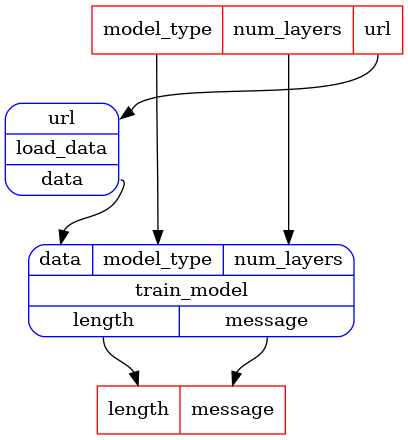

## Tutorial notebook: inspecting and running a registered pipeline.


```python
import rats.processors as rp
```


```python
app = rp.NotebookApp()
```


List all the registered pipelines


```python
eps = app.executable_pipelines()
list(eps)
```


_cell output_:
```output
['examples.untyped_simple_pipeline',
 'examples.typed_simple_pipeline',
 'examples.complex_pipeline']
```


Choose one of the registered pipelines.  Print the documentation.


```python
ep = eps["examples.untyped_simple_pipeline"]
print(ep.doc)
```
_cell output_:
```output

Example untyped simple pipeline.  Looks like a training pipeline, but does not really do anything
besides some string manipulation to construct a message.

Defined in `/home/bletchley/repos/rats/rats-processors/src/python/rats/processors/example_pipelines/_simple_untyped_pipeline.py`
```

Get the pipeline object.


```python
p = ep.provider()
```


Inpect it: print it's input and output ports, and display its graph.

You might get an error message asking you to install Graphviz. If you do, install it and rerun.


```python
print("Pipeline input ports:", p.inputs)
print("Pipeline output ports:", p.outputs)

app.display(p)
```
_cell output_:
```output
Pipeline input ports: InPorts(url=InPort[str], model_type=InPort[str], num_layers=InPort[int])
Pipeline output ports: OutPorts(message=OutPort[str], length=OutPort[int])
```





Run the pipeline with some inputs
(remember this is a fake training pipeline, it just constructs some message.)


```python
outputs = app.run(
    p,
    inputs={
        "model_type": "linear",
        "num_layers": 20,
        "url": "https://something",
    },
)
```


Print the outputs (keyed by port name)


```python
print(outputs["message"])
```
_cell output_:
```output
Training model with data: Data from https://something with config linear, 20
```

```python

```
