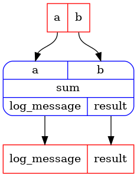

## Tutorial: self-contained pipeline classes


```python
import rats.processors as rp
from rats import apps

app = rp.NotebookApp()
```


# Single node pipeline
A pipeline node holds a reference to a processor, i.e. the function that will be executed when
the node is run.
The processor function is expected to take annotated arguments and return a NamedTuple.  The
annotations will become the pipeline's inputs, and the entries of the NamedTuple will become the
pipeline's outputs.
To create a single node pipeline, create a class that inherits from `PipelineContainer` and
annotate a method with the `task` decorator.


```python
from typing import NamedTuple


class _SumOutputs(NamedTuple):
    result: float
    log_message: str


class SimplePipelineContainer(rp.PipelineContainer):
    @rp.task
    def sum(self, a: float, b: float) -> _SumOutputs:
        result = a + b
        log_message = f"{a} + {b} = {result}"
        return _SumOutputs(result=result, log_message=log_message)


spc = SimplePipelineContainer()
```


The `task` decorator converts the method into a method that takes nothing and returns a function:


```python
import inspect

print(inspect.signature(spc.sum))
```
_cell output_:
```output
() -> rats.processors._legacy_subpackages.ux._pipeline.Pipeline[+TInputs, +TOutputs]
```
It also registers the method as a service, which means you should not call the method directly.
instead you should get a service id and the service the container:


```python
service_id = apps.autoid(spc.sum)  # or apps.autoid(SimplePipelineContainer.sum)
p1 = spc.get(service_id)
```


Let's look at the pipeline:


```python
print("Pipeline input ports:", p1.inputs)
print("Pipeline output ports:", p1.outputs)

app.display(p1)
```
_cell output_:
```output
Pipeline input ports: InPorts(a=InPort[float], b=InPort[float])
Pipeline output ports: OutPorts(result=OutPort[float], log_message=OutPort[str])
```





Run the pipeline:


```python
outputs = app.run(
    p1,
    inputs={
        "a": 1.0,
        "b": 2.0,
    },
)
```


Print the outputs:


```python
for k in outputs:
    print(f"{k}: {outputs[k]}")
```
_cell output_:
```output
result: 3.0
log_message: 1.0 + 2.0 = 3.0
```
