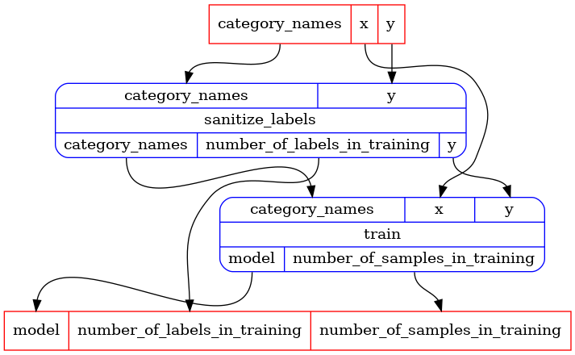
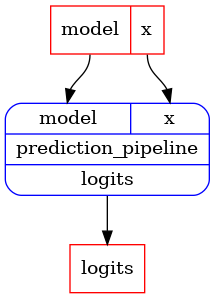

```python
# type: ignore
# there are multiple typing issues in pandas and the iris dataset, easier to disable typing for
# this notebook
```


## Tutorial: self-contained pipeline classes - Logistic Regression using sklearn


```python
from collections.abc import Sequence
from typing import NamedTuple

import pandas as pd
from sklearn.linear_model import LogisticRegression as LR

import rats.processors as rp
from rats import apps
```

Let's build something a little more interesting - logistic regression using sklearn, with
safeguards using pandas dataframes.


First we'll create a `Model` class that will hold the bare sklearn LR model, but also the meta
information that verifies that a pandas dataframe can be used to predict with the model.


```python
class Model(NamedTuple):
    bare_model: LR
    feature_names: tuple[str, ...]
    category_names: tuple[str, ...]
```

Next, we'll build pipelines in a container class.
As before, we need to define NamedTuple classes for the output of each task.


```python
class _SanitizeLabelsOutput(NamedTuple):
    y: pd.Series
    category_names: tuple[str, ...]
    number_of_labels_in_training: int


class _LRTrainOutput(NamedTuple):
    model: Model
    number_of_samples_in_training: int


class _LRPredictOutput(NamedTuple):
    logits: pd.DataFrame


class LRPipelineContainer(rp.PipelineContainer):
    @rp.task
    def sanitize_labels(
        self, category_names: Sequence[str], y: pd.Series
    ) -> _SanitizeLabelsOutput:
        """Remove rows with NaN labels and verify that the remaining labels are expected categories."""
        category_names = tuple(category_names)
        # Remove rows with NaN labels.
        # They are allowed, but not used in training.
        y = y[~y.isna()]
        # Verify that the remaining labels are in the allowed set
        if not y.isin(category_names).all():
            raise ValueError(f"Labels should be in {category_names}")
        category_name_to_index = {name: i for i, name in enumerate(category_names)}
        y = y.map(category_name_to_index)
        number_of_labels_in_training = len(y)
        return _SanitizeLabelsOutput(
            y=y,
            number_of_labels_in_training=number_of_labels_in_training,
            category_names=category_names,
        )

    @rp.task
    def train(
        self, category_names: tuple[str, ...], x: pd.DataFrame, y: pd.Series
    ) -> _LRTrainOutput:
        """Train a logistic regression model.

        Samples (x) and labels (y) will be matched by index.  Unmatches samples/labels will not be
        used in training.
        """
        label_name = str(y.name)
        if label_name in x.columns:
            raise ValueError(
                f"Label column {label_name} should not be a column of the features dataframe"
            )
        # Join the features and labels.
        j = x.join(y, how="inner")
        number_of_samples_in_training = len(j)
        x = j.drop(label_name, axis=1)
        y = j[label_name]
        lr = LR()
        lr.fit(X=x.to_numpy(), y=y.to_numpy())
        feature_names = tuple(x.columns)
        return _LRTrainOutput(
            Model(
                bare_model=lr,
                feature_names=feature_names,
                category_names=category_names,
            ),
            number_of_samples_in_training=number_of_samples_in_training,
        )

    @rp.pipeline
    def training_pipeline(self) -> rp.typing.UPipeline:
        """Train a binary logistic regression model.

        Samples not associated with labels or whose labels are NaN will be ignored.
        Non-binary labels will raise an error.
        """
        sanitize = self.get(apps.autoid(self.sanitize_labels))
        train = self.get(apps.autoid(self.train))
        return self.combine(
            pipelines=(
                sanitize,
                train,
            ),
            dependencies=(sanitize >> train,),
        )

    @rp.task
    def prediction_pipeline(
        self,
        model: Model,
        x: pd.DataFrame,
    ) -> _LRPredictOutput:
        # Reorder the columns by the order in which they were used in training.
        x = x[list(model.feature_names)]
        logits_np = model.bare_model.predict_log_proba(X=x.to_numpy())
        logits = pd.DataFrame(
            logits_np, index=x.index, columns=list(model.category_names)
        )
        return _LRPredictOutput(logits=logits)


lrpc = LRPipelineContainer()
app = rp.NotebookApp()
```


Let's inspect the pipelines:


```python
training_pipeline = lrpc.get(apps.autoid(lrpc.training_pipeline))
print("Training pipeline input ports:", training_pipeline.inputs)
print("Training pipeline output ports:", training_pipeline.outputs)
print("Training pipeline:")
app.display(training_pipeline)
```
_cell output_:
```output
Training pipeline input ports: InPorts(category_names=InPort[collections.abc.Sequence[str]], y=InPort[pandas.core.series.Series], x=InPort[pandas.core.frame.DataFrame])
Training pipeline output ports: OutPorts(number_of_labels_in_training=OutPort[int], model=OutPort[__main__.Model], number_of_samples_in_training=OutPort[int])
Training pipeline:
```





```python
prediction_pipeline = lrpc.get(apps.autoid(lrpc.prediction_pipeline))
print("Prediction pipeline input ports:", prediction_pipeline.inputs)
print("Prediction pipeline output ports:", prediction_pipeline.outputs)
print("Prediction pipeline:")
app.display(prediction_pipeline)
```
_cell output_:
```output
Prediction pipeline input ports: InPorts(model=InPort[__main__.Model], x=InPort[pandas.core.frame.DataFrame])
Prediction pipeline output ports: OutPorts(logits=OutPort[pandas.core.frame.DataFrame])
Prediction pipeline:
```





To run the training pipeline we'll need a samples dataframe and a labels series.
We can then run the prediction pipeline with the trained model and a samples dataframe.
Let's use the Iris dataset, splitting to train/test randomly.


```python
from sklearn import datasets

iris = datasets.load_iris()
category_names = tuple(iris["target_names"])

samples = pd.DataFrame(iris["data"], columns=iris["feature_names"])
labels = pd.Series(iris["target"], name="label").map(lambda i: category_names[i])
train_indices = samples.sample(frac=0.8).index
samples_train = samples.loc[train_indices]
labels_train = labels.loc[train_indices]
samples_test = samples.drop(train_indices)[
    iris["feature_names"][::-1]
]  # Reverse the columns
labels_test = labels.drop(train_indices)
```


```python
training_outputs = app.run(
    training_pipeline,
    inputs=dict(
        category_names=category_names,
        x=samples_train,
        y=labels_train,
    ),
)
```


```python
prediction_outputs_train = app.run(
    prediction_pipeline,
    inputs=dict(
        model=training_outputs["model"],
        x=samples_train,
    ),
)
```


```python
prediction_outputs_test = app.run(
    prediction_pipeline,
    inputs=dict(
        model=training_outputs["model"],
        x=samples_test,
    ),
)
```

join predictions with labels to see how well the model did.


```python
prediction_outputs_train["logits"].join(labels_train).groupby("label").agg(
    ["mean", "std", "count"]
)
```


<div>
<style scoped>
    .dataframe tbody tr th:only-of-type {
        vertical-align: middle;
    }

    .dataframe tbody tr th {
        vertical-align: top;
    }

    .dataframe thead tr th {
        text-align: left;
    }

    .dataframe thead tr:last-of-type th {
        text-align: right;
    }
</style>
<table border="1" class="dataframe">
  <thead>
    <tr>
      <th></th>
      <th colspan="3" halign="left">setosa</th>
      <th colspan="3" halign="left">versicolor</th>
      <th colspan="3" halign="left">virginica</th>
    </tr>
    <tr>
      <th></th>
      <th>mean</th>
      <th>std</th>
      <th>count</th>
      <th>mean</th>
      <th>std</th>
      <th>count</th>
      <th>mean</th>
      <th>std</th>
      <th>count</th>
    </tr>
    <tr>
      <th>label</th>
      <th></th>
      <th></th>
      <th></th>
      <th></th>
      <th></th>
      <th></th>
      <th></th>
      <th></th>
      <th></th>
    </tr>
  </thead>
  <tbody>
    <tr>
      <th>setosa</th>
      <td>-0.028816</td>
      <td>0.013404</td>
      <td>39</td>
      <td>-3.678306</td>
      <td>0.511105</td>
      <td>39</td>
      <td>-16.203267</td>
      <td>1.027410</td>
      <td>39</td>
    </tr>
    <tr>
      <th>versicolor</th>
      <td>-4.530525</td>
      <td>1.409147</td>
      <td>40</td>
      <td>-0.211417</td>
      <td>0.218309</td>
      <td>40</td>
      <td>-2.577951</td>
      <td>1.349122</td>
      <td>40</td>
    </tr>
    <tr>
      <th>virginica</th>
      <td>-10.261770</td>
      <td>3.004484</td>
      <td>41</td>
      <td>-2.682173</td>
      <td>1.433396</td>
      <td>41</td>
      <td>-0.174503</td>
      <td>0.210629</td>
      <td>41</td>
    </tr>
  </tbody>
</table>
</div>


```python
prediction_outputs_test["logits"].join(labels_test).groupby("label").agg(
    ["mean", "std", "count"]
)
```


<div>
<style scoped>
    .dataframe tbody tr th:only-of-type {
        vertical-align: middle;
    }

    .dataframe tbody tr th {
        vertical-align: top;
    }

    .dataframe thead tr th {
        text-align: left;
    }

    .dataframe thead tr:last-of-type th {
        text-align: right;
    }
</style>
<table border="1" class="dataframe">
  <thead>
    <tr>
      <th></th>
      <th colspan="3" halign="left">setosa</th>
      <th colspan="3" halign="left">versicolor</th>
      <th colspan="3" halign="left">virginica</th>
    </tr>
    <tr>
      <th></th>
      <th>mean</th>
      <th>std</th>
      <th>count</th>
      <th>mean</th>
      <th>std</th>
      <th>count</th>
      <th>mean</th>
      <th>std</th>
      <th>count</th>
    </tr>
    <tr>
      <th>label</th>
      <th></th>
      <th></th>
      <th></th>
      <th></th>
      <th></th>
      <th></th>
      <th></th>
      <th></th>
      <th></th>
    </tr>
  </thead>
  <tbody>
    <tr>
      <th>setosa</th>
      <td>-0.026165</td>
      <td>0.011916</td>
      <td>11</td>
      <td>-3.732637</td>
      <td>0.385093</td>
      <td>11</td>
      <td>-16.298619</td>
      <td>0.933422</td>
      <td>11</td>
    </tr>
    <tr>
      <th>versicolor</th>
      <td>-4.162033</td>
      <td>1.126673</td>
      <td>10</td>
      <td>-0.147582</td>
      <td>0.083114</td>
      <td>10</td>
      <td>-2.925414</td>
      <td>1.521059</td>
      <td>10</td>
    </tr>
    <tr>
      <th>virginica</th>
      <td>-10.198897</td>
      <td>2.301786</td>
      <td>9</td>
      <td>-2.861008</td>
      <td>1.326860</td>
      <td>9</td>
      <td>-0.132432</td>
      <td>0.171354</td>
      <td>9</td>
    </tr>
  </tbody>
</table>
</div>


```python

```

Next, we'll build pipelines that incorporate pipelines defined in other containers.
